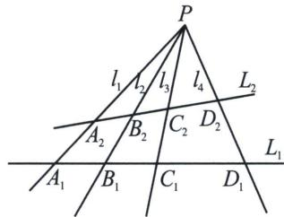
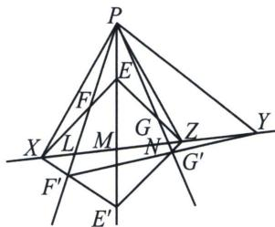

> [!faq]- 《圆锥曲线专题(下册)》例题解析
>
> > [!success]- **【答案】** 详见解析
>
> > [!note]- **【解析】**
> > $$
> > (2) (A _ {1}, B _ {1}; C _ {1}, D _ {1}) = \frac {A _ {1} C _ {1} \cdot B _ {1} D _ {1}}{B _ {1} C _ {1} \cdot A _ {1} D _ {1}} = \frac {S _ {\triangle P A _ {1} C _ {1}} \cdot S _ {\triangle P B _ {1} D _ {1}}}{S _ {\triangle P B _ {1} C _ {1}} \cdot S _ {\triangle P A _ {1} D _ {1}}} = \frac {\frac {1}{2} \cdot P A _ {1} \cdot P C _ {1} \cdot \sin \angle A _ {1} P C _ {1} \cdot \frac {1}{2} \cdot P B _ {1} \cdot P D _ {1} \cdot \sin \angle B _ {1} P D _ {1}}{\frac {1}{2} \cdot P B _ {1} \cdot P C _ {1} \cdot \sin \angle B _ {1} P C _ {1} \cdot \frac {1}{2} \cdot P A _ {1} \cdot P D _ {1} \cdot \sin \angle A _ {1} P D _ {1}}
> > $$
> >
> > $$
> > = \frac {\sin \angle A _ {1} P C _ {1} \cdot \sin \angle B _ {1} P D _ {1}}{\sin \angle B _ {1} P C _ {1} \cdot \sin \angle A _ {1} P D _ {1}} = \frac {\sin \angle A _ {2} P C _ {2} \cdot \sin \angle B _ {2} P D _ {2}}{\sin \angle B _ {2} P C _ {2} \cdot \sin \angle A _ {2} P D _ {2}} = \frac {S _ {\triangle P A _ {2} C _ {2}} \cdot S _ {\triangle P B _ {2} D _ {2}}}{S _ {\triangle P B _ {2} C _ {2}} \cdot S _ {\triangle P A _ {2} D _ {2}}} = \frac {A _ {2} C _ {2} \cdot B _ {2} D _ {2}}{B _ {2} C _ {2} \cdot A _ {2} D _ {2}} = (A _ {2}, B _ {2}; C _ {2}, D _ {2});
> > $$
> >
> > 
> >
> > (3)设 EF 与 $E^{\prime}F^{\prime}$ 交于 X，FG 与 $F^{\prime}G^{\prime}$ 交于 Y，EG 与 $E^{\prime}G^{\prime}$ 交于 Z，连接 XY， $FF^{\prime}$ 与 XY 交于 L， $EE^{\prime}$ 与 XY 交于 M， $GG^{\prime}$ 与 XY 交于 N，欲证 X，Y，Z 三点共线，只需证 Z 在直线 XY 上，
> >
> > 
> >
> > 考虑线束 XP, XE, XM, $XE'$ ，由第(2)问知(P, F; L, $F'$ )=(P, E; M, $E'$ ),
> >
> > 再考虑线束 YP，YF，YL， $YF'$ ，由第(2)问知(P，F；L， $F'$ )=(P，G；N， $G'$ )，
> >
> > 从而得到 $(P, E; M, E')=(P, G; N, G')$ ,
> >
> > 于是由第(2)问的逆命题知，EG，MN， $E^{\prime}G^{\prime}$ 交于一点，即为点Z，
> >
> > 从而 MN 过点 Z，故 Z 在直线 XY 上，X，Y，Z 三点共线.
