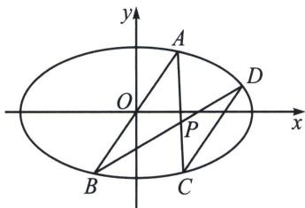

## 五、定点(极点)不在坐标轴上的定比点差

椭圆 $\frac{x^2}{a^2} +\frac{y^2}{b^2} = 1(a > b > 0)$ ，点 $A(x_{1},y_{1})$ 、 $B(x_{2},y_{2})$ 是椭圆上的点，且 $\overrightarrow{AP} = \lambda \overrightarrow{PB}$ ， $P(x_0,y_0)$ ，则：

$\left\{ \begin{array}{l} \lambda x_{2} = x_{0}(1 + \lambda) - x_{1} \\ \lambda y_{2} = y_{0}(1 + \lambda) - y_{1} \\ \left( \frac{x_{0}x_{1}}{a^{2}} + \frac{y_{0}y_{1}}{b^{2}} - 1 \right) = \frac{1 + \lambda}{2} \cdot \left( \frac{x_{0}^{2}}{a^{2}} + \frac{y_{0}^{2}}{b^{2}} - 1 \right) \end{array} \right.$ （非轴点弦三炮齐鸣起手式，方便理解，不是最终方程）

即点 $A(x_{1},y_{1})$ 、 $B(x_{2},y_{2})$ 的坐标都可以用只含有 $x_{1}$ （或 $y_{1}$ )的式子表示出来.

证明：由 $\overrightarrow{AP} = \lambda \overrightarrow{PB}$ 得： $\left\{ \begin{array}{l} x_0 = \frac{x_1 + \lambda x_2}{1 + \lambda} \\ y_0 = \frac{y_1 + \lambda y_2}{1 + \lambda} \end{array} \right.$ ，即 $\left\{ \begin{array}{l} \lambda x_2 = x_0(1 + \lambda) - x_1 \\ \lambda y_2 = y_0(1 + \lambda) - y_1 \end{array} \right.$ ①，利用定比点差法得：

$$
\left\{ \begin{array}{l} \frac {x _ {1} ^ {2}}{a ^ {2}} + \frac {y _ {1} ^ {2}}{b ^ {2}} = 1 \\ \frac {\lambda^ {2} x _ {2} ^ {2}}{a ^ {2}} + \frac {\lambda^ {2} y _ {2} ^ {2}}{b ^ {2}} = \lambda^ {2} \end{array} \Rightarrow \frac {(x _ {1} + \lambda x _ {2}) (x _ {1} - \lambda x _ {2})}{a ^ {2}} + \frac {(y _ {1} + \lambda y _ {2}) (y _ {1} - \lambda y _ {2})}{b ^ {2}} = 1 - \lambda^ {2},, \right.
$$

即 $\frac{x_0(x_1 - \lambda x_2)}{a^2} +\frac{y_0(y_1 - \lambda y_2)}{b^2} = 1 - \lambda$ ，代入(1)，消去 $\lambda x_{2}$ 、 $\lambda y_{2}$ ，整理可得：

$$
\frac {x _ {0} x _ {1}}{a ^ {2}} + \frac {y _ {0} y _ {1}}{b ^ {2}} - 1 = \frac {(1 + \lambda)}{2} \left(\frac {x _ {0} ^ {2}}{a ^ {2}} + \frac {y _ {0} ^ {2}}{b ^ {2}} - 1\right) \dots \dots ②,
$$

如果消去 $x_{1}$ 、 $x_{2}$ ，整理可得： $\frac{x_0x_2}{a^2} +\frac{y_0y_2}{b^2} -1 = \left(\frac{x_0^2}{a^2} +\frac{y_0^2}{b^2} -1\right)\cdot \frac{\left(1 + \frac{1}{\lambda}\right)}{2}.$

在上面椭圆的基础上，我们也可以大胆推测，对于抛物线 $y^{2} = 2px$ ，设点 $A(x_{1},y_{1})$ 、 $B(x_{2},y_{2})$ 为抛物线上的点，且 $\overrightarrow{AP} = \lambda \overrightarrow{PB}$ ， $P(x_{0},y_{0})$ ，则亦有公式：

$$
\left\{y _ {0} y _ {1} - p (x _ {0} + x _ {1}) = \frac {(1 + \lambda)}{2} \cdot (y _ {0} ^ {2} - 2 p x _ {0}) \right.
$$

$$
\left\{y _ {0} y _ {2} - p (x _ {0} + x _ {2}) = \frac {\left(1 + \frac {1}{\lambda}\right)}{2} \cdot (y _ {0} ^ {2} - 2 p x _ {0}), \right.
$$

例如图, 已知椭圆 $E: \frac{x^{2}}{a^{2}} + \frac{y^{2}}{b^{2}} = 1 (a > b > 0)$ 的离心率为 $\frac{\sqrt{2}}{2}$ , 点 $A\left(\frac{1}{3}, \frac{2}{3}\right)$ 在椭圆 $E$ 上, 射线 $AO$ 与椭圆 $E$ 的另一交点为 $B$ , 点 $P(-4t, t)$ 在椭圆 $E$ 内部, 射线 $AP$ 、 $BP$ 与椭圆 $E$ 的另一交点分别为 $C$ 、 $D$ .

(1)求椭圆 E 的方程;

(2)求证: 直线 $CD$ 的斜率为定值.

## 解析 (1) $x^{2} + 2y^{2} = 1$

(2)设 $A(x_{1}y_{1})$ ， $B(x_{2}y_{2})$ ， $C(x_{3}y_{3})$ ， $D(x_{4}y_{4})$ ，设 $\overrightarrow{AP} = \lambda \overrightarrow{PC}$ ， $\overrightarrow{BP} = \mu \overrightarrow{PD}$

$\overrightarrow{AP} = \lambda \overrightarrow{PC}$ 得： $\left\{ \begin{array}{l} -4t = \frac{x_1 + \lambda x_3}{1 + \lambda}\\ t = \frac{y_1 + \lambda y_3}{1 + \lambda} \end{array} \right.$ 即 $\left\{ \begin{array}{l}\lambda x_{3} = -4t(1 + \lambda) - x_{1}\\ \lambda y_{3} = t(1 + \lambda) - y_{1} \end{array} \right.$ ①

利用非轴点弦三炮齐鸣起手式得： $\frac{x_1 + \lambda x_2}{1 + \lambda}\cdot \frac{x_1 - \lambda x_3}{1 - \lambda} +2\frac{y_1 + \lambda y_3}{1 + \lambda}\cdot \frac{y_1 - \lambda y_3}{1 - \lambda} = 1, - 4t(x_1 - \lambda x_3) +$ $2t(y_{1} - \lambda y_{3}) = 1 - \lambda ,$ ①代入得： $\lambda = \frac{1 + 18t^2 + 4t(2x_1 - y_1)}{1 - 18t^2}$ ②，同理 $\mu = \frac{1 + 18t^2 + 4t(2x_2 - y_2)}{1 - 18t^2}$ ③

由于直线 AB 的方程为：y=2x，所以 $2x_{1}-y_{1}=2x_{2}-y_{2}=0$ ，结合②③，易得 $\lambda=\mu$ ，

故 $AB \parallel CD$ ，即 $k_{CD} = k_{AB} = 2$ .

![[高中/总复习/专题/2026版高中《mst老唐说题》圆锥曲线专题（数学）/下册/第11章_从定比点差到极点极线/第一节_单比与交比/五_定点_极点_不在坐标轴上的定比点差/例题/Q00053152.md]]
