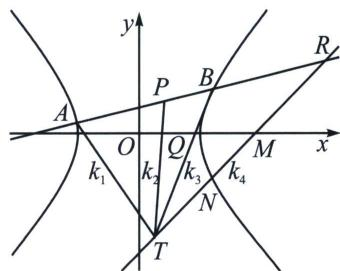

<!-- question-source:start -->
例12 (2023年3月南师附中月考)在平面直角坐标系 $xOy$ 中, 双曲线 $\frac{x^2}{a^2} - \frac{y^2}{b^2} = 1 (0 < a < 3, b > 0)$ 的离心率为 $\sqrt{2}$ , 斜率为 $\frac{b}{a}$ 的直线 $m$ 经过点 $M(3, 0)$ , 点 $N$ 是直线 $m$ 与双曲线的交点, 且 $|MN| = \sqrt{2}$ .

(1)求双曲线的方程;

(2)若经过定点 $P(1, 1)$ 的直线 $l$ 与双曲线相交于 $A, B$ 两点, 经过点 $A$ 斜率为 $-2$ 的直线与直线 $m$ 的交点为 $T$ , 求证: 直线 $BT$ 经过 $x$ 轴上的定点.

(1) 双曲线方程为 $x^{2} - y^{2} = 3$ .

设 $A(x_{1},y_{1})$ ， $B(x_{2},y_{2})$ ， $\overrightarrow{AP} = \lambda \overrightarrow{PB}$ ，则在直线 $AB$ 上存在一点 $R$ ，使得 $\overrightarrow{AR} = -\lambda \overrightarrow{RB}$ ，根据定比分点公式， $x_{P} = 1 = \frac{x_{1} + \lambda x_{2}}{1 + \lambda}\Rightarrow \lambda x_{2} = 1 + \lambda -x_{1}$ ， $y_{P} = 1 = \frac{y_{1} + \lambda y_{2}}{1 + \lambda}\Rightarrow \lambda y_{2} = 1 + \lambda -y_{1}$ ， $x_{R} = \frac{x_{1} - \lambda x_{2}}{1 - \lambda}$ ， $y_{R} = \frac{y_{1} - \lambda y_{2}}{1 - \lambda}$ ， $\left\{ \begin{array}{l}\frac{x_1^2}{3} -\frac{y_1^2}{3} = 1①\\ \frac{\lambda^2x_2^2}{3} -\frac{\lambda^2y_2^2}{3} = \lambda^2② \end{array} \right.$ ①-②得 $\frac{(x_1 + \lambda x_2)(x_1 - \lambda x_2)}{3} -\frac{(y_1 + \lambda y_2)(y_1 - \lambda y_2)}{3} = 1 - \lambda^2$ ，则 $\frac{x_1 - \lambda x_2}{3(1 - \lambda)} -\frac{y_1 - \lambda y_2}{3(1 - \lambda)} =$ 1，即 $\frac{2x_1 - \lambda - 1}{3(1 - \lambda)} -\frac{2y_1 - \lambda - 1}{3(1 - \lambda)} = 1$ ，所以 $\lambda = \frac{3 - 2x_1 + 2y_1}{3}$ ③，代入 $\lambda x_{2} = 1 + \lambda -x_{1}$ 得： $x_{2} = \frac{6 - 5x_{1} + 2y_{1}}{3 - 2x_{1} + 2y_{1}}$ ，同理，代入 $\lambda y_{2} = 1 + \lambda -y_{1}$ 得： $y_{2} = \frac{6 - 2x_{1} - y_{1}}{3 - 2x_{1} + 2y_{1}}$ ，联立 $\left\{ \begin{array}{l}l_{AT}:y - y_1 = -2(x - x_1)\\ m:y = x - 3 \end{array} \right.\Rightarrow T\left(\frac{2x_1 + y_1 + 3}{3},\frac{2x_1 + y_1 - 6}{3}\right)$ 设 $BT$ 过定点 $Q(t,0)$ ，则一定满足 $x_{2}y_{T} - x_{T}y_{2} = t(y_{T} - y_{2})$ ，我们代入数据，探索定值 $t$ ， $\frac{6 - 5x_1 + 2y_1}{3 - 2x_1 + 2y_1}\frac{2x_1 + y_1 - 6}{3} -\frac{2x_1 + y_1 + 3}{3}\frac{6 - 2x_1 - y_1}{3 - 2x_1 + 2y_1} = t\left(\frac{2x_1 + y_1 - 6}{3} -\frac{6 - 2x_1 - y_1}{3 - 2x_1 + 2y_1}\right),$ 即 $(6 - 5x_{1} + 2y_{1})(2x_{1} + y_{1} - 6) + (2x_{1} + y_{1} + 3)(2x_{1} + y_{1} - 6) = t[(2x_{1} + y_{1} - 6)(3 - 2x_{1} + 2y_{1}) + 3(2x_{1} + y_{1} - 6)]$ ，探索常数项相等即可得-54=-36t， $t = \frac{3}{2}$ ，即 $l_{BT}$ 过定点 $\left(\frac{3}{2},0\right)$
<!-- question-source:end -->

![[高中/总复习/专题/2026版高中《mst老唐说题》圆锥曲线专题（数学）/下册/第11章_从定比点差到极点极线/第一节_单比与交比/五_定点_极点_不在坐标轴上的定比点差/例题/answers/Q00048791A1.md]]
