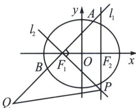

<!-- question-source:start -->
例8 (2022·山东模拟)已知椭圆 $C: \frac{x^2}{a^2} + \frac{y^2}{b^2} = 1 (a > b > 0)$ 的离心率 $e = \frac{1}{2}$ , 且经过点 $\left(1, \frac{3}{2}\right)$ , 点 $F_1$ , $F_2$ 为椭圆 $C$ 的左、右焦点.

(1)求椭圆 C 的方程;

(2) 过点 $F_{1}$ 分别作两条互相垂直的直线 $l_{1}$ ， $l_{2}$ ，且 $l_{1}$ 与椭圆交于不同两点 A，B， $l_{2}$ 与直线 x=1 交于点 P。若 $\overrightarrow{AF_{1}} = \lambda \overrightarrow{F_{1}B}$ ，且点 Q 满足 $\overrightarrow{QA} = \lambda \overrightarrow{QB}$ ，求 $\triangle PQF_{1}$ 面积的最小值。

##
<!-- question-source:end -->

![[高中/总复习/专题/2026版高中《mst老唐说题》圆锥曲线专题（数学）/下册/第11章_从定比点差到极点极线/第一节_单比与交比/四_定点_极点_在坐标轴上的定比点差/例题/answers/Q00053149A1.md]]
