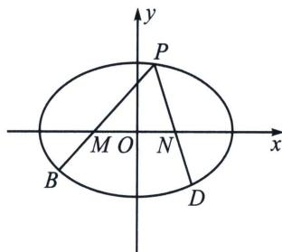

<!-- question-source:start -->
例9 (2025·广州零模第17题)已知椭圆 $C: \frac{x^2}{a^2} + \frac{y^2}{b^2} = 1 (a > b > 0)$ 的左、右焦点分别为 $F_1, F_2$ ，离心率为 $\frac{\sqrt{3}}{2}$ ，长轴长与短轴长之和为6.

(1)求椭圆 C 的方程;

(2)已知 $M(-1,0)$ ， $N(1,0)$ ，点 P 为椭圆 C 上一点，设直线 PM 与椭圆 C 的另一个交点为点 B，直线 PN 与椭圆 C 的另一个交点为点 D。设 $\overrightarrow{PM} = \lambda_{1}\overrightarrow{MB}$ ， $\overrightarrow{PN} = \lambda_{2}\overrightarrow{ND}$ ，求证：当点 P 在椭圆 C 上运动时， $\lambda_{1} + \lambda_{2}$ 为定值。

<!-- question-source:end -->

![[高中/总复习/专题/2026版高中《mst老唐说题》圆锥曲线专题（数学）/下册/第11章_从定比点差到极点极线/第一节_单比与交比/四_定点_极点_在坐标轴上的定比点差/例题/answers/Q00053150A1.md]]
