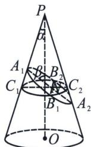
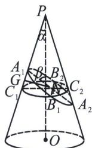
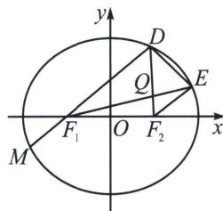

<!-- question-source:start -->
例10 (2025·武汉开学)如图, 已知圆锥 $PO$ 的高 $PO$ 与母线所成的角为 $\alpha$ , 过 $A_{1}$ 的平面与圆锥的高所成的角为 $\beta$ , 该平面截这个圆锥所得的截面为椭圆 $C$ , 椭圆 $C$ 的长轴为 $A_{1}A_{2}$ , 短轴为 $B_{1}B_{2}$ , 长轴长为 $2a$ , $C$ 的中心为 $N$ , 再以 $B_{1}B_{2}$ 为弦且垂直于 $PO$ 的圆截面, 记该圆与直线 $PA_{1}$ 交于 $C_{1}$ , 与直线 $PA_{2}$ 交于 $C_{2}$ ,

(1)用 $a, \alpha, \beta$ 分别表示 $\left|NC_{1}\right|$ , $\left|NC_{2}\right|$ ;

(2) 若 $\cos\alpha=\frac{1}{3}$ ， $\cos\beta=\frac{1}{9}$ ，a=3；

(i) 求椭圆 C 的焦距;

（ii）椭圆 C 左右焦点分别为 $F_{1}$ ， $F_{2}$ ，C 上不同两点 D，E 在长轴同侧，且 $DF_{1} \parallel EF_{2}$ ，设直线 $F_{1}E$ ， $F_{2}D$ 交于点 Q，记 $S_{\triangle QDE} = s$ ，设 $S_{四边形EDF_{1}F_{2}} = f(s)$ ，请写出 $f(s)$ 的解析式（不要求求出定义域）.

<!-- question-source:end -->

![[高中/总复习/专题/2026版高中《mst老唐说题》圆锥曲线专题（数学）/下册/第11章_从定比点差到极点极线/第一节_单比与交比/四_定点_极点_在坐标轴上的定比点差/例题/answers/Q00053151A1.md]]
