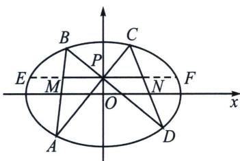
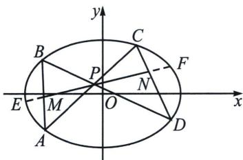
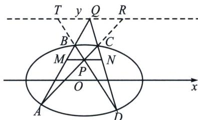

## 一、蝴蝶定理

如左图所示， $P$ 为 $y$ 轴上一点，若 $AC$ 与 $BD$ 交于 $P$ ，过 $P$ 作与 $x$ 轴平行的直线交 $AB$ 和 $CD$ 于 $MN$ ，交椭圆 $\Gamma$ 于 $EF$ ，则 $|PM| = |PN|$ .

如右图，若 $P$ 为弦 $EF$ 中点，则 $P$ 一定为 $MN$ 中点，即 $|PM| = |PN|$ ，我们把这种蝴蝶型的共中点定理叫做蝴蝶定理.

证明：如图，延长 AB 与 DC 交于 Q，过 Q 作 MN 的平行线交 DB 延长线于 T，交 AC 延长线于 R，易知 TR 为以 P 为极点的极线，以 P 为射影中心，利用交比不变性， $(AB, MQ) = (DC, NQ) = -1$ ，以 Q 为射影中心，利用交比不变性， $(TP, BD) = (RP, CA) = -1$ ，故 $\frac{PM}{TQ} = \frac{PM}{QR} = \frac{PN}{TQ} = \frac{PN}{QR} \Rightarrow \begin{cases} PM = PN \\ TQ = QR \end{cases}$

![[高中/总复习/专题/2026版高中《mst老唐说题》圆锥曲线专题（数学）/下册/第11章_从定比点差到极点极线/第三节_蝴蝶定理与坎迪定理/一_蝴蝶定理/例题/Q00048798.md]]
