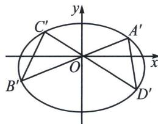

> [!faq]- 《圆锥曲线专题(下册)》例题解析
>
> > [!success]- **【答案】** 详见解析
>
> > [!note]- **【解析】**
> > 解法一(定比点差): 令 $\overrightarrow{AP} = \lambda \overrightarrow{PB}$ , $\overrightarrow{CP} = \mu \overrightarrow{PD}$ , $M(m, 1)$ , $N(n, 1)$ ,
> >
> > 根据定比点差得： $\left\{ \begin{array}{l}y_{A} = \frac{5}{2} +\frac{-3}{2}\lambda \\ y_{B} = \frac{5}{2} +\frac{-3}{2\lambda}\\ x_{A} + \lambda x_{B} = 0 \end{array} \right.$ ， $\left\{ \begin{array}{l}y_{C} = \frac{5}{2} +\frac{-3}{2}\mu \\ y_{D} = \frac{5}{2} +\frac{-3}{2\mu}\\ x_{C} + \mu x_{D} = 0 \end{array} \right.$ ， $\frac{y_C - y_M}{x_C - x_M} = \frac{y_B - y_M}{x_B - x_M},\frac{\frac{3}{2} - \frac{3}{2}\mu}{-\mu x_D - m} = \frac{\frac{3}{2} - \frac{3}{2\lambda}}{-\frac{1}{\lambda}x_A - m} =$
> >
> > $\frac{\frac{3}{2}\lambda - \frac{3}{2}}{-x_A - \lambda m}$ ，所以 $\frac{1 - \mu}{\lambda - 1} = \frac{-\mu x_D - m}{-x_A - \lambda m}$ ①， $\frac{y_A - y_N}{x_A - x_N} = \frac{y_D - y_N}{x_D - x_N}$ ， $\frac{\frac{3}{2} - \frac{3}{2}\lambda}{x_A - n} = \frac{\frac{3}{2} - \frac{3}{2}\mu}{x_D - n} = \frac{\frac{3}{2}\mu - \frac{3}{2}}{\mu x_D - \mu n}$ ，
> >
> > 所以 $\frac{\mu - 1}{1 - \lambda} = \frac{\mu x_D - \mu n}{x_A - n}$ ②，由 ① ② 得： $\frac{\mu x_D + m}{x_A + \lambda m} = \frac{\mu x_D - \mu m}{x_A - n} = \frac{\mu x_D + m - \mu x_D + \mu m}{\lambda m + n} = \frac{m + \mu m}{\lambda m + n}, \frac{m + \mu m}{\lambda m + n} = \frac{\mu - 1}{1 - \lambda}$ ，所以 $\frac{\frac{m}{n} + \mu}{\lambda \frac{m}{n} + 1} = \frac{\mu - 1}{1 - \lambda}$ ，所以 $\frac{m}{n} = -1$ ，所以 $|PM| = |PN|$ .
> >
> > 
> >
> > 解法二(平移曲线系): 将椭圆按(0, -1)平移得: $\frac{x^{2}}{8} + \frac{y^{2}}{4} + \frac{y}{2} - \frac{3}{4} = 0$
> >
> > $$
> > A ^ {\prime} B ^ {\prime}: y = k _ {1} x, C ^ {\prime} D ^ {\prime}: y = k _ {2} x, A ^ {\prime} D ^ {\prime}: x = k _ {3} y + m _ {1}, B ^ {\prime} C ^ {\prime}: x = k _ {4} y + m _ {2},
> > $$
> >
> > $$
> > (k _ {1} x - y) (k _ {2} x - y) + \lambda (x - k _ {3} y - m _ {1}) (x - k _ {4} y - m _ {2}) = \mu \left(\frac {x ^ {2}}{8} + \frac {y ^ {2}}{4} + \frac {y}{2} - \frac {3}{4}\right)
> > $$
> >
> > 所以 $x$ 系数： $\lambda (-m_1 - m_2) = 0$ ，所以 $m_{1} + m_{2} = 0$
