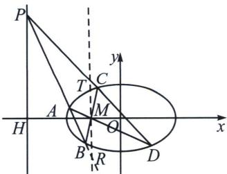
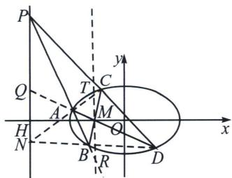

## 三、坎迪定理中点推论

如图，A、B、C、D 是圆锥曲线上的点，BA 与 DC 延长线交于 P，AD 与 BC 交于 M，易知 PH 是以 M 为极点的极线，过 M 作 TR // PH 交 PD 与 PB 于 T 和 R，则 MT = MR.

证明：如右图所示，直线 $PN$ 为点 $M$ 对应的极线，则 $(QM, AD) = -1$ ，又 $PQ // RT$ ， $\frac{TM}{PQ} = \frac{DM}{DQ} = \frac{AM}{AQ} = \frac{MR}{PQ}$ ，所以 $MT = MR$ .

![[高中/总复习/专题/2026版高中《mst老唐说题》圆锥曲线专题（数学）/下册/第11章_从定比点差到极点极线/第三节_蝴蝶定理与坎迪定理/三_坎迪定理中点推论/例题/Q00048799.md]]
![[高中/总复习/专题/2026版高中《mst老唐说题》圆锥曲线专题（数学）/下册/第11章_从定比点差到极点极线/第三节_蝴蝶定理与坎迪定理/三_坎迪定理中点推论/例题/Q00048800.md]]
![[高中/总复习/专题/2026版高中《mst老唐说题》圆锥曲线专题（数学）/下册/第11章_从定比点差到极点极线/第三节_蝴蝶定理与坎迪定理/三_坎迪定理中点推论/例题/Q00048801.md]]
