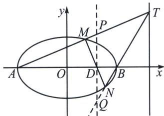

<!-- question-source:start -->
例2 (2010·江苏)椭圆 $\frac{x^{2}}{9}+\frac{y^{2}}{5}=1$ 的左右顶点为 $A, B$ 右焦点为 $F$ . 设过点 $T(9, m)$ 的直线 $TA, TB$ 分别与椭圆交于 $M(x_{1}, y_{1}), N(x_{2}, y_{2})$ , 其中 $m>0, y_{1}>0, y_{2}<0$ . 求证: 直线 $MN$ 必过 $x$ 轴上一个定点.

<!-- question-source:end -->

![[高中/总复习/专题/2026版高中《mst老唐说题》圆锥曲线专题（数学）/下册/第11章_从定比点差到极点极线/第三节_蝴蝶定理与坎迪定理/三_坎迪定理中点推论/例题/answers/Q00048799A1.md]]
