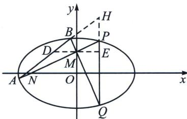

<!-- question-source:start -->
例3 (2016·山东)已知椭圆 $C: \frac{x^2}{a^2} + \frac{y^2}{b^2} = 1 (a > b > 0)$ 的长轴长为 4，焦距为 $2\sqrt{2}$ .

(1)求椭圆 C 的方程;

(2) 过动点 $M(0, m) (m > 0)$ 的直线交 $x$ 轴与点 $N$ , 交 $C$ 于点 $A$ , $P(P$ 在第一象限), 且 $M$ 是线段 $PN$ 的

## 高中数学 新思路 圆锥专题

中点. 过点 $P$ 作 $x$ 轴的垂线交 $C$ 于另一点 $Q$ , 延长 $QM$ 交 $C$ 于点 $B$ .

①设直线 $PM$ ， $QM$ 的斜率分别为 $k_{1}$ ， $k_{2}$ ，证明 $\frac{k_{2}}{k_{1}}$ 为定值；

②求直线 $AB$ 的斜率的最小值.

(1)设椭圆的半焦距为 $c$ . 由题意知 $2a = 4, 2c = 2\sqrt{2}$ ,

所以 a=2， $b=\sqrt{a^{2}-c^{2}}=\sqrt{2}$ 。所以椭圆 C 的方程为 $\frac{x^{2}}{4}+\frac{y^{2}}{2}=1$ 。

(2)证明: ①设 $P(x_{0}, y_{0}) (x_{0} > 0, y_{0} > 0)$ , 由 $M(0, m)$ , 可得 $P(x_{0}, 2m), Q(x_{0}, -2m)$ . 所以直线 $PM$ 的斜率 $k_{1} = \frac{2m - m}{x_{0}} = \frac{m}{x_{0}}$ , 直线 $QM$ 的斜率 $k_{2} = \frac{-2m - m}{x_{0}} = -\frac{3m}{x_{0}}$ ,

此时 $\frac{k_2}{k_1} = -3$ ，所以 $\frac{k_2}{k_1}$ 为定值-3.

②极点极线背景: 延长 $AB$ 和 $PQ$ 交于 $H$ , 易知 $M$ 与 $H$ 调和共轭, 即 $y_{M}y_{H}=2$ , 故 $y_{H}=\frac{2}{m}$ , 过 $M$ 作 $x$ 轴平行线交 $AB$ 于 $D$ , 交 $PQ$ 于 $E$ , 根据蝴蝶定理知 $MD=ME$ , 故 $k_{AB}=\frac{y_{N}-y_{M}}{2x_{0}}=\frac{\frac{2}{m}-m}{2x_{0}}$ , 由于 $P(x_{0}, 2m)$ 在椭圆上, 故令 $\left\{\begin{array}{l} x_{0}=2 \cos \theta \\ 2m=\sqrt{2} \sin \theta \end{array}\right.$ , 故 $k=\frac{2\sqrt{2}-\frac{\sqrt{2}}{2} \sin^{2} \theta}{4 \sin \theta \cos \theta}=\frac{\sqrt{2}(3 \sin^{2} \theta+4 \cos^{2} \theta)}{8 \sin \theta \cos \theta}=\frac{\sqrt{2}}{8}\left(3 \tan \theta+\frac{4}{\tan \theta}\right) \geqslant\frac{\sqrt{6}}{2}$ , 当且仅当 $\tan \theta=\frac{2\sqrt{3}}{3}$ 时等号成立.

（ii）解法一（定比点差）：设 $A(x_{1},y_{1})$ ， $B(x_{2},y_{2})$ ， $\overrightarrow{AM} = \lambda \overrightarrow{MB}$ ， $\overrightarrow{BM} = \mu \overrightarrow{MQ}$ ，根据定比点差法 $\left\{ \begin{array}{l}x_{1} + \lambda x_{0} = 0\\ x_{2} + \mu x_{0} = 0 \end{array} \right.$

$\left\{ \begin{array}{l} y_{1} = \frac{m + \frac{2}{m}}{2} + \frac{m - \frac{2}{m}}{2}\lambda \\ y_{2} = \frac{m + \frac{2}{m}}{2} + \frac{m - \frac{2}{m}}{2}\mu \end{array} \right., k = \frac{y_{2} - y_{1}}{x_{2} - x_{1}} = -\frac{m - \frac{2}{m}}{2x_{0}},$ 令 $\left\{ \begin{array}{l} x_0 = 2\cos \theta \\ 2m = \sqrt{2}\sin \theta \end{array} \right.$ 故 $k = -\frac{\frac{\sqrt{2}}{2}\sin^2\theta - 2\sqrt{2}}{4\sin\theta\cos\theta}$

$k=\frac{\sqrt{2}(3\sin^{2}\theta+4\cos^{2}\theta)}{8\sin\theta\cos\theta}=\frac{\sqrt{2}}{8}\left(3\tan\theta+\frac{4}{\tan\theta}\right)\geqslant\frac{\sqrt{6}}{2}$ ，当且仅当 $\tan\theta=\frac{2\sqrt{3}}{3}$ 时等号成立.
<!-- question-source:end -->

![[高中/总复习/专题/2026版高中《mst老唐说题》圆锥曲线专题（数学）/下册/第11章_从定比点差到极点极线/第三节_蝴蝶定理与坎迪定理/三_坎迪定理中点推论/例题/answers/Q00048800A1.md]]
