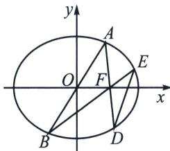
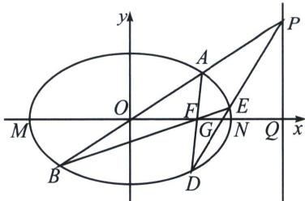

<!-- question-source:start -->
例4 (2023·江苏模拟)在平面直角坐标系 $xOy$ 中, 椭圆 $C: \frac{x^2}{a^2} + \frac{y^2}{b^2} = 1 (a > b > 0)$ 的离心率是 $\frac{1}{2}$ , 焦点到相应准线的距离是 3.

(1) 求 a, b 的值;

(2)已知 A、B 是椭圆 C 上关于原点对称的两点，A 在 x 轴的上方， $F(1,0)$ ，连接 AF、BF 并分别延长交椭圆 C 于 D、E 两点，证明：直线 DE 过定点.

(1)由题意可得 $\frac{c}{a} = \frac{1}{2}$ , $\frac{a^2}{c} - c = 3$ , 解得 $a = 2, c = 1$ , 所以 $b^2 = a^2 - c^2 = 4 - 1 = 3$ , 故 $b = \sqrt{3}$ ;

(2)极点极线背景分析: 设椭圆左右顶点为 $M, N, DE$ 交 $x$ 轴于 $G$ , 根据坎迪定理, 可知 $\frac{1}{|FG|} - \frac{1}{|OF|}$ $= \frac{1}{|FN|} - \frac{1}{|FM|} \Rightarrow |FG| = \frac{3}{5}$ , 故 $G\left(\frac{8}{5}, 0\right)$ ; $\frac{k_{AB}}{k_{DE}} = \frac{k_{OP}}{k_{GP}} = \frac{|GQ|}{|OQ|} = \frac{3}{5}$
<!-- question-source:end -->

![[高中/总复习/专题/2026版高中《mst老唐说题》圆锥曲线专题（数学）/下册/第11章_从定比点差到极点极线/第三节_蝴蝶定理与坎迪定理/三_坎迪定理中点推论/例题/answers/Q00048801A1.md]]
