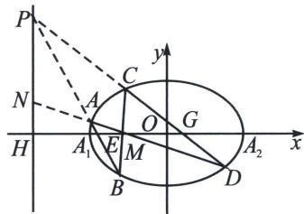
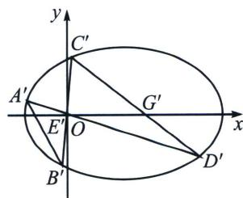
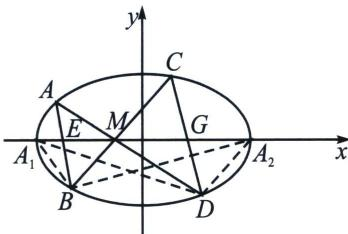
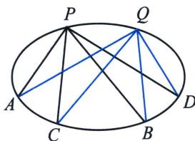
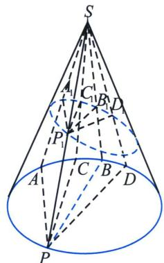
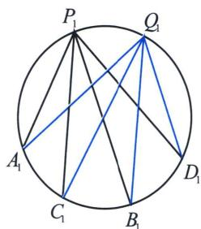

## 二、坎迪定理

如图，A、B、C、D都是椭圆上的动点，已知 $M(m,0)$ ， $H\left(\frac{a^{2}}{m},0\right)$ ，AC与BD交于点M，则一定有：
① $\frac{k_{AB}}{k_{CD}}=\frac{MG}{ME}=\frac{HG}{HE}$ ，② $\frac{1}{MG}-\frac{1}{ME}=\frac{1}{MA_{2}}-\frac{1}{MA_{1}}$ .

证明①: 根据极点极线知识, $M$ 与 $H$ 调和共轭, $A B$ 与 $C D$ 交点 $P$ 一定在直线 $x = \frac{a^2}{m}$ 上, 以 $M$ 为射影中心, 利用交比不变性, $(P E, A B) = (P G, C D) = -1$ , 以 $P$ 为射影中心, 利用交比不变性, $(N M, A D) = (H M, E G) = -1$ , 故 $\frac{k_{A B}}{k_{C D}} = \frac{k_{P E}}{k_{P G}} = \frac{H G}{H E} = \frac{M G}{M E}$ ,

证明②：解法一（平移构造曲线系）：将椭圆按照 $\overrightarrow{MO} = (m,0)$ 平移得： $\frac{(x - m)^2}{a^2} +\frac{y^2}{b^2} = 1$ ，当 $y = 0$ 时， $(x - m)^2 = a^2$ ， $\frac{1}{|OA_2'|} -\frac{1}{|OA_1'|} = \frac{1}{x_1} +\frac{1}{x_2} = \frac{x_1 + x_2}{x_1x_2} = \frac{2m}{m^2 - a^2}$ ，此时设 $A^{\prime}D^{\prime}$ ： $x = t_{1}y$ ， $B^{\prime}C^{\prime}$ ： $x = t_{2}y$ ， $A^{\prime}$ $B^{\prime}$ ： $x = t_{3}y + m_{1}$ ， $C^{\prime}D^{\prime}$ ： $x = t_{4}y + m_{2}$

此时曲线系方程为： $(x - t_{3}y - m_{1})(x - t_{4}y - m_{2}) + \lambda (x - t_{1}y)(x - t_{2}y) = \mu \left(\frac{x^{2}}{a^{2}} +\frac{y^{2}}{b^{2}} -\frac{2mx}{a^{2}} +\frac{m^{2}}{a^{2}} -1\right)$

常数项系数： $m_{1}m_{2} = \mu \left(\frac{m^{2}}{a^{2}} -1\right)$ ； $x$ 系数： $-m_{1} - m_{2} = -\frac{2\mu m}{a^{2}}$ ； $y$ 系数为0： $m_2t_3 + m_1t_4 = 0$

$\frac{1}{|OG'|}-\frac{1}{|OE'|}=\frac{1}{m_{1}}+\frac{1}{m_{2}}=\frac{m_{1}+m_{2}}{m_{1}m_{2}}=\frac{2m}{m^{2}-a^{2}}$ ，所以 $\frac{1}{|OA_{2}'|}-\frac{1}{|OA_{1}'|}=\frac{1}{|OG'|}-\frac{1}{|OE'|}=\frac{2m}{m^{2}-a^{2}}$

解法二(交比角元不变性): 由于 $B(A_{1} C, A A_{2}) = D (A_{1} C, A A_{2})$ ,

又 $B(A_{1}C, AA_{2}) = B(A_{1}M, EA_{2}) = (A_{1}M, EA_{2})$ ，所以 $\frac{A_{1}E}{ME} \cdot \frac{MA_{2}}{A_{1}A_{2}} = \frac{A_{1}M - ME}{ME} \cdot \frac{MA_{2}}{A_{1}A_{2}}$

$D(A_{1}C, AA_{2}) = D(A_{1}G, MA_{2}) = (A_{1}G, MA_{2})$ ，所以 $\frac{A_1M}{MG}\cdot \frac{GA_2}{A_1A_2} = \frac{A_1M}{MG}\cdot \frac{MA_2 - MG}{A_1A_2}$

$\frac{A_{1}M-ME}{ME}\cdot\frac{MA_{2}}{A_{1}A_{2}}=\frac{A_{1}M}{MG}\cdot\frac{MA_{2}-MG}{A_{1}A_{2}}$ ，即 $\frac{MA_{1}-ME}{MA_{1}\cdot ME}=\frac{MA_{2}-MG}{MA_{2}\cdot MG}$ ，所以 $\frac{1}{MG}-\frac{1}{ME}=\frac{1}{MA_{2}}-\frac{1}{MA_{1}}$

注意 蝴蝶定理其实是坎迪定理的特殊形式，即 M 为 $A_{1}A_{2}$ 中点时的特例.

补充定理：圆周角交比不变性

设 P, Q, A, B, C, D 为圆锥曲线上六个不同的点，A, B, C, D 为定点，P, Q 为动点，则 $P(AB, CD)=Q(AB, CD)$ .

证明: 如图, 以圆锥的顶点为射影中心, 以椭圆为截面, $SP$ , $SA$ , $SB$ , $SC$ , $SD$ 分别交椭圆截面于 $P_{1}$ , $A_{1}$ , $B_{1}$ , $C_{1}$ , $D_{1}$ , 根据交比射影不变性以及, 显然有 $P(AB, CD) = P_{1}(A_{1}B_{1}, C_{1}D_{1})$ . 根据圆的圆周 [396] 老唐说题

角定理，如右图，根据交比的不变性 $P_{1}(A_{1}B_{1}, C_{1}D_{1}) = Q_{1}(A_{1}B_{1}, C_{1}D_{1})$ ，所以 $P(AB, CD) = Q(AB, CD)$ .

