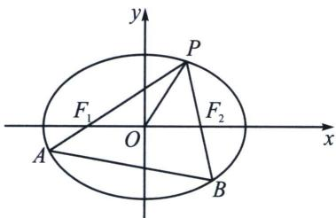
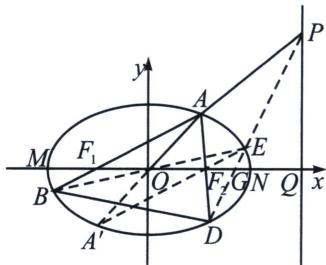

<!-- question-source:start -->
例5 (2025·杭州高二期中第19题)已知椭圆 $C: \frac{x^2}{a^2} + \frac{y^2}{b^2} = 1 (a > b > 0)$ 的左、右焦点分别为 $F_1, F_2$ 离心率为 $\frac{\sqrt{2}}{2}$ , 设 $P(x_0, y_0)$ 是第一象限内椭圆 $C$ 上的一点, $PF_1$ 、 $PF_2$ 的延长线分别交椭圆 $C$ 于点 $A, B$ , 连接 $OP, AB, AF_2$ , 若 $\triangle APF_2$ 的周长为 $4\sqrt{2}$ .

(1)求椭圆 C 的方程;

(2)当 $PF_{2} \perp x$ 轴，求 $\triangle PAF_{2}$ 的面积；

(3)若分别记 OP，AB 的斜率分别为 $k_{1}$ ， $k_{2}$ ，求 $\frac{1}{k_{2}} - \frac{1}{k_{1}}$ 的最大值.

<!-- question-source:end -->

![[高中/总复习/专题/2026版高中《mst老唐说题》圆锥曲线专题（数学）/下册/第11章_从定比点差到极点极线/第三节_蝴蝶定理与坎迪定理/四_利用对称和焦弦常数构造斜率关系/例题/answers/Q00053159A1.md]]
