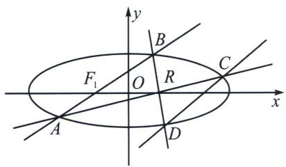
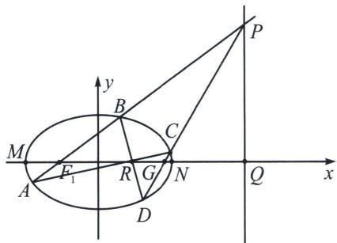

<!-- question-source:start -->
例6 已知椭圆 $C: \frac{x^2}{a^2} + \frac{y^2}{b^2} = 1 (a > b > 0)$ 的离心率为 $\frac{2}{3}$ , 半焦距为 $c (c > 0)$ , 且 $a - c = 1$ , 经过椭圆的左焦点 $F_1$ 斜率为 $k_1 (k_1 \neq 0)$ 的直线与椭圆交于 $A$ 、 $B$ 两点, $O$ 为坐标原点.

(1)求椭圆 C 的标准方程;

(2)设 $R(1,0)$ , 延长 $AR$ , $BR$ 分别与椭圆交于 $C$ 、 $D$ 两点, 直线 $CD$ 的斜率为 $k_{2}$ , 求 $\frac{k_{1}}{k_{2}}$ 的值.

<!-- question-source:end -->

![[高中/总复习/专题/2026版高中《mst老唐说题》圆锥曲线专题（数学）/下册/第11章_从定比点差到极点极线/第三节_蝴蝶定理与坎迪定理/四_利用对称和焦弦常数构造斜率关系/例题/answers/Q00053160A1.md]]
