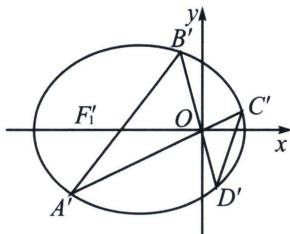

> [!faq]- 《圆锥曲线专题(下册)》例题解析
>
> > [!success]- **【答案】** 详见解析
>
> > [!note]- **【分析】**
> > 设椭圆左右顶点为 $M, N, C D$ 交 $x$ 轴于 $G, P Q: x = 9$ , 根据坎迪定理, 可知 $\frac {1}{| F _ { 1 } R |} - \frac { 1 } { | R G | } = \frac { 1 } { | R M | } - \frac { 1 } { | R N | } \Rightarrow | R G | = \frac { 1 2 } { 7 }$ , 故 $G \left( \frac { 1 9 } { 7 }, 0 \right)$ ; $\frac { k _ { A B } } { k _ { C D } } = \frac { k _ { P F _ { 1 } } } { k _ { P G } } = \frac { | G Q | } { | F _ { 1 } Q | } = \frac { 9 - \frac { 1 9 } { 7 } } { 9 + 2 } = \frac { 4 } { 7 }$
>
> > [!note]- **【解析】**
> > 
> > 解法一(曲线系): 将椭圆向左平移一个单位得: $\frac{(x+1)^{2}}{9}+\frac{y^{2}}{5}=1$ , 即: $\frac{x^{2}}{9}+\frac{y^{2}}{5}+\frac{2}{9}x-\frac{8}{9}=0$
> > $$
> > A ^ {\prime} C ^ {\prime}: x = \frac {y}{k _ {3}}, B ^ {\prime} D ^ {\prime}: x = \frac {y}{k _ {4}}, A ^ {\prime} B ^ {\prime}: x = \frac {y}{k _ {1}} - 3, C ^ {\prime} D ^ {\prime}: x = \frac {y}{k _ {2}} + m
> > $$
> > 故曲线系方程为： $\left(x - \frac{y}{k_2} -m\right)\left(x - \frac{y}{k_1} +3\right) + \lambda \left(x - \frac{y}{k_3}\right)\left(x - \frac{y}{k_4}\right) = \mu \left(\frac{x^2}{9} +\frac{y^2}{5} +\frac{2}{9} x - \frac{8}{9}\right)$
> > $$
> > x ^ {2}: 1 + \lambda = \frac {\mu}{9}
> > $$
> > 常： $-3m=-\frac{8}{9}\mu$ $\Rightarrow$ $m=\frac{12}{7}$ $x: 3-m=\frac{2}{9}\mu$ $\mu=\frac{81}{14}$ ， $y:\frac{m}{k_{1}}-\frac{3}{k_{2}}=0$ 所以 $k_{1}=\frac{4}{7}k_{2}$ .
> > 解法二(定比点差): 设 $AB: y = k_{1}(x + 2), A(x_{1}, y_{1}), B(x_{2}, y_{2}), C(x_{3}, y_{3}), D(x_{4}, y_{4}), \overrightarrow{AR} = \lambda \overrightarrow{RC}, \overrightarrow{BR} = \mu \overrightarrow{RD}$ ,
> > 根据定比点差(过程省略)， $\left\{\begin{aligned}x_{1}&=5-4\lambda\\ x_{3}&=5-\frac{4}{\lambda}\\ y_{1}&+\lambda y_{3}=0\end{aligned}\right.\left\{\begin{aligned}x_{2}&=5-4\mu\\ x_{4}&=5-\frac{4}{\mu}\\ y_{2}&+\mu y_{4}=0\end{aligned}\right.$ ， $\frac{y_{3}-y_{4}}{x_{3}-x_{4}}=\frac{\frac{-y_{1}}{\lambda}-\frac{-y_{2}}{\mu}}{\left(5-\frac{4}{\lambda}\right)-\left(5-\frac{4}{\mu}\right)}=\frac{-\frac{k_{1}x_{1}+2k}{\lambda}+\frac{k_{1}x_{2}+2k}{\mu}}{-\frac{4}{\lambda}+\frac{4}{\mu}}$ $=\frac{-\frac{k_{1}(5-4\lambda)+2k_{1}}{\lambda}+\frac{k_{1}(5-4\mu)+2k_{1}}{\mu}}{-\frac{4}{\lambda}+\frac{4}{\mu}}=\frac{-7\left(\frac{1}{\lambda}-\frac{1}{\mu}\right)k_{1}}{-4\left(\frac{1}{\lambda}-\frac{1}{\mu}\right)}=\frac{7}{4}k_{1}.$
> > 
