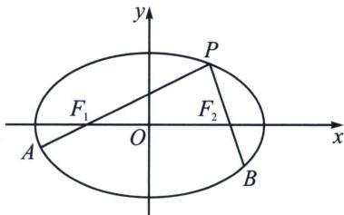

## 四、利用对称和焦弦常数构造斜率关系

焦弦常数: 设点 $P$ 为椭圆或双曲线上任一点, 过焦点 $F_{1} 、 F_{2}$ 分别作弦 $P A 、 P B$ , 设 $\overrightarrow{P F_{1}} = \lambda \overrightarrow{F_{1} A}, \overrightarrow{P F_{2}} = \mu \overrightarrow{F_{2} B}$ , 则 $\lambda + \mu = \frac{2 (a ^{2} + c ^{2})}{a ^{2} - c ^{2}} = \frac{2 (1 + e ^{2})}{1 - e ^{2}}$ . 证明过程参考例题.

推广：如果将焦点 $F_{1}$ 、 $F_{2}$ 换成 $M_{1}(-m,0)$ 、 $M_{2}(m,0)$ ，则 $\lambda +\mu = \frac{2(a^2 + m^2)}{a^2 - m^2}.$

证明：对 $\left\{\begin{aligned}\overrightarrow{PM_{1}}&=\lambda\overrightarrow{M_{1}}A\\\overrightarrow{PM_{2}}&=\mu\overrightarrow{M_{2}}A\end{aligned}\right.$ ，利用定比点差法易得： $\left\{\begin{aligned}2x_{p}&=-m-\frac{a^{2}}{m}+\left(-m+\frac{a^{2}}{m}\right)\lambda①\\ 2x_{p}&=m+\frac{a^{2}}{m}+\left(m-\frac{a^{2}}{m}\right)\mu②\end{aligned}\right.$

①-②得： $\lambda+\mu=\frac{2(a^{2}+m^{2})}{a^{2}-m^{2}}.$

![[高中/总复习/专题/2026版高中《mst老唐说题》圆锥曲线专题（数学）/下册/第11章_从定比点差到极点极线/第三节_蝴蝶定理与坎迪定理/四_利用对称和焦弦常数构造斜率关系/例题/Q00053159.md]]
![[高中/总复习/专题/2026版高中《mst老唐说题》圆锥曲线专题（数学）/下册/第11章_从定比点差到极点极线/第三节_蝴蝶定理与坎迪定理/四_利用对称和焦弦常数构造斜率关系/例题/Q00053160.md]]
