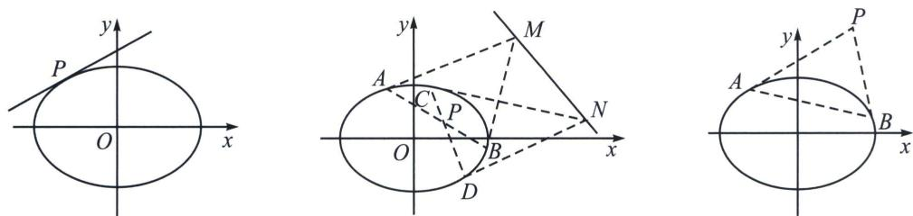
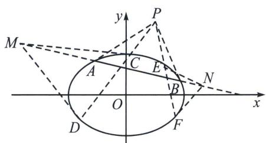
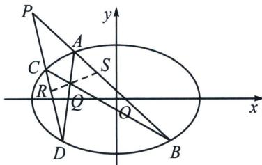
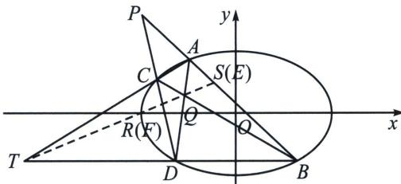
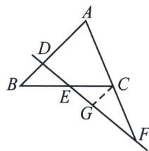
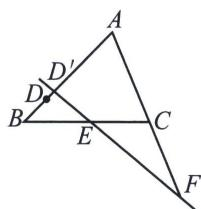
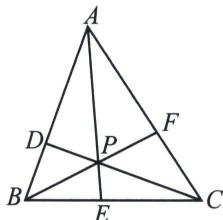
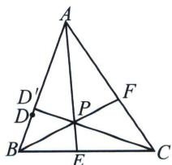

## 一、极点极线的定义

## 1. 二次曲线的替换法则

$$
A x ^ {2} + B x y + C y ^ {2} + D x + E y + F = 0
$$

$$
x x _ {0}
$$

$$
x ^ {2}
$$

$$
y y _ {0}
$$

$$
y ^ {2}
$$

$$
\frac {x _ {0} y + x y _ {0}}{2}
$$

代 $xy$ ，用 $\frac{x + x_0}{2}$ 代 $x$ ，用 $\frac{y + y_0}{2}$ 代 $y$ ，常数项不变，

可得方程： $Axx_{0}+B\cdot\frac{x_{0}y+xy_{0}}{2}+Cyy_{0}+D\cdot\frac{x+x_{0}}{2}+E\cdot\frac{y+y_{0}}{2}+F=0.$

## 2. 极点极线的代数定义

高中阶段，常见的二次曲线的极点极线的方程如下：

(1)圆：

①极点 $P(x_{0}, y_{0})$ 关于圆 $x^{2} + y^{2} = r^{2}$ 的极线方程是 $xx_{0} + yy_{0} = r^{2}$ ;

②极点 $P(x_0, y_0)$ 关于圆 $(x - a)^2 + (y - b)^2 = r^2$ 的极线方程是 $(x - a)(x_0 - a) + (y - b)(y_0 - b) = r^2$ ;

③极点 $P(x_{0}, y_{0})$ 关于圆 $x^{2} + y^{2} + Dx + Ey + F = 0$ 的极线方程是： $xx_{0} + yy_{0} + D \cdot \frac{x + x_{0}}{2} + E \cdot \frac{y + y_{0}}{2} + F = 0.$

(2)椭圆：

极点 $P(x_{0}, y_{0})$ 关于椭圆 $\frac{x^{2}}{a^{2}} + \frac{y^{2}}{b^{2}} = 1$ 的极线方程是： $\frac{xx_{0}}{a^{2}} + \frac{yy_{0}}{b^{2}} = 1$ .

(3) 双曲线：

极点 $P(x_0, y_0)$ 关于双曲线 $\frac{x^2}{a^2} - \frac{y^2}{b^2} = 1$ 的极线方程是： $\frac{xx_0}{a^2} - \frac{yy_0}{b^2} = 1.$

(4)抛物线

极点 $P(x_{0}, y_{0})$ 关于抛物线 $y^{2}=2px$ 的极线方程是： $y_{0}y=p(x+x_{0})$ .

注：①极点极线是成对出现的；

②焦点和焦点对应的准线就是最常见的极点极线；

③已知定比分点为极点，则其调和分点一定位于其对应极线上！

## 3. 极点极线的几何意义

(1)若极点 P 在二次曲线上，则极线是过点 P 的切线方程.

(2)若极点 $P$ 在二次曲线内部, 则极线是过点 $P$ 的弦两端端点的切线交点的轨迹. 如图所示, 过点 $P$ 的弦 $A B 、 C D$ 的两端端点作切线, 得到的直线 $M N$ 即为点 $P$ 对应的极线轨迹. 【极线和二次曲线必定相离】

(3)若极点 P 在二次曲线外部，分成两种情况：

①极线在二次曲线内的部分是点 P 对二次曲线的切点弦；【极线和二次曲线必定相交】

②极线在二次曲线外的部分是过点 P 的弦两端端点的切线交点的轨迹.

## 二、极点极线定理证明

如下图所示, 设非中心点 $P$ 不在椭圆 $\frac{x^{2}}{a^{2}} + \frac{y^{2}}{b^{2}} = 1$ 上, 过 $P$ 作椭圆的两割线 $PAB$ 和 $PCD$ , 连接 $AD$ 和 $BC$ 交于 $Q$ , 则 $\frac{x_{P}x_{Q}}{a^{2}} + \frac{y_{P}y_{Q}}{b^{2}} = 1$ .

证明：如图所示，在线段 $AB$ 上取一点 $S$ ，使 $B, S, A, P$ 为调和点列 $\left\{ \begin{array}{l} \overrightarrow{AP} = \lambda \overrightarrow{PB} \\ \overrightarrow{AS} = -\lambda \overrightarrow{SB} \end{array} \right.$ ，根据定比点差法（过程省略）可知： $\frac{x_S x_P}{a^2} + \frac{y_S y_P}{b^2} = 1$ ，同理在 $CD$ 上取一点 $R$ ，使 $D, R, C, P$ 为调和点列 $\left\{ \begin{array}{l} \overrightarrow{CP} = \mu \overrightarrow{PD} \\ \overrightarrow{CR} = -\mu \overrightarrow{RD} \end{array} \right.$ ，则有 $\frac{x_R x_P}{a^2} + \frac{y_R y_P}{b^2} = 1$ ，由于 $R, S$ 均在同构方程 $\frac{x_P \cdot x}{a^2} + \frac{y_P \cdot y}{b^2} = 1$ 上，所以直线 $RS$ 的方程为 $\frac{x_P \cdot x}{a^2} + \frac{y_P \cdot y}{b^2} = 1$ ，连接 $RS$ ，我们仅仅需要证 $AD, BC, RS$ 三线共点 $Q$ 即可，此时我们需要借助一下梅涅劳斯定理和塞瓦定理，由于借助平面几何知识，延长 $AC$ 和 $BD$ 交于 $T$ ，连接 $TQ$ 交 $AB$ 和 $CD$ 分别于 $E$ 和 $F$ 点，我们需证 $R, Q, S$ 三点共线，则只需证 $S$ 与 $E$ 重合， $R$ 与 $F$ 重合

在 $\triangle TCD$ 中， $Q$ 是其塞瓦点，根据塞瓦定理可知： $\frac{TA}{AC} \cdot \frac{CF}{FD} \cdot \frac{DB}{BT} = 1$ ，

在 $\triangle TCD$ 中， $PAB$ 为其截线，根据梅涅劳斯定理得： $\frac{TA}{AC} \cdot \frac{CP}{PD} \cdot \frac{DB}{BT} = 1$

所以 $\frac{CF}{FD} = \frac{CP}{PD}$ ，由于 $\frac{CR}{RD} = \frac{CP}{PD}$ ，故 $R$ 与 $F$ 重合，同理可证 $S$ 与 $E$ 重合，

故点 Q 在直线 RS 上，所以 $\frac{x_{Q}x_{P}}{a^{2}} + \frac{y_{Q}y_{P}}{b^{2}} = 1$ ，命题得证！

注意 关于梅涅劳斯定理和塞瓦定理及其逆定理，均属于高中数学联赛的知识，高中课本上是没有做要求的，考试不能直接拿来证明，但是其对应的比值性质与极点极线的调和共轭属性完美契合，属于证明极点极线的最佳方法.

补充定理：

1. 梅涅劳斯定理

定理: 一条直线与 $\triangle ABC$ 的三边 $AB 、 BC 、 CA$ 所在直线分别交于点 $D 、 E 、 F$ , 且 $D 、 E 、 F$ 均不是

$\triangle ABC$ 的顶点，则有 $\frac{AD}{DB} \cdot \frac{BE}{EC} \cdot \frac{CF}{FA} = 1$

证明：如图，过点 C 作 AB 的平行线，交 EF 于点 G.

因为 $CG \parallel AB$ ，所以 $\frac{CG}{AD} = \frac{CF}{FA}$ ①，因为 $CG \parallel AB$ ，所以 $\frac{CG}{DB} = \frac{EC}{BE}$ ②

由①÷②可得 $\frac{DB}{AD}=\frac{BE}{EC}\cdot\frac{CF}{FA}$ ，即得 $\frac{AD}{DB}\cdot\frac{BE}{EC}\cdot\frac{CF}{FA}=1.$

## 2. 梅涅劳斯定理的逆定理

定理: 在 $\triangle ABC$ 的边 $AB$ 、 $BC$ 上各有一点 $D$ 、 $E$ , 在边 $AC$ 的延长线上有一点 $F$ , 若 $\frac{AD}{DB} \cdot \frac{BE}{EC} \cdot \frac{CF}{FA} = 1$ , 那么 $D$ 、 $E$ 、 $F$ 三点共线.

证明：设直线 EF 交 AB 于点 $D'$ ，则据梅涅劳斯定理有 $\frac{AD'}{D'B} \cdot \frac{BE}{EC} \cdot \frac{CF}{FA} = 1$ .

因为 $\frac{AD}{DB} \cdot \frac{BE}{EC} \cdot \frac{CF}{FA} = 1$ ，所以有 $\frac{AD}{DB} = \frac{AD'}{D'B}$ 。由于点 $D$ 、 $D'$ 都在线段 $AB$ 上，所以点 $D$ 与 $D'$ 重合。即得 $D$ 、 $E$ 、 $F$ 三点共线。

## 3. 塞瓦定理

定理: 在 $\triangle ABC$ 内一点 $P$ , 该点与 $\triangle ABC$ 的三个顶点相连所在的三条直线分别交 $\triangle ABC$ 三边 $AB$ 、 $BC$ 、 $CA$ 于点 $D$ 、 $E$ 、 $F$ , 且 $D$ 、 $E$ 、 $F$ 三点均不是 $\triangle ABC$ 的顶点, 则有 $\frac{AD}{DB} \cdot \frac{BE}{EC} \cdot \frac{CF}{FA} = 1$ .

证明: 运用面积比可得 $\frac{AD}{DB} = \frac{S_{\triangle ADP}}{S_{\triangle BDP}} = \frac{S_{\triangle ADC}}{S_{\triangle BDC}}$ . 根据等比定理有: $\frac{S_{\triangle ADP}}{S_{\triangle BDP}} = \frac{S_{\triangle ADC}}{S_{\triangle BDC}} = \frac{S_{\triangle ADC} - S_{\triangle ADP}}{S_{\triangle BDC} - S_{\triangle BDP}} = \frac{S_{\triangle APC}}{S_{\triangle BPC}}$ , 所以 $\frac{AD}{DB} = \frac{S_{\triangle APC}}{S_{\triangle BPC}}$ . 同理可得 $\frac{BE}{EC} = \frac{S_{\triangle APB}}{S_{\triangle APC}}, \frac{CF}{FA} = \frac{S_{\triangle BPC}}{S_{\triangle APB}}$ , 三式相乘得 $\frac{AD}{DB} \cdot \frac{BE}{EC} \cdot \frac{CF}{FA} = 1$ .

## 4. 塞瓦定理的逆定理

定理: 在 $\triangle ABC$ 三边 $AB$ 、 $BC$ 、 $CA$ 上各有一点 $D$ 、 $E$ 、 $F$ , 且 $D$ 、 $E$ 、 $F$ 均不是 $\triangle ABC$ 的顶点, 若 $\frac{AD}{DB} \cdot \frac{BE}{EC} \cdot \frac{CF}{FA} = 1$ , 那么直线 $CD$ 、 $AE$ 、 $BF$ 三线共点.

证明: 设直线 $AE$ 与直线 $BF$ 交于点 $P$ , 直线 $CP$ 交 $AB$ 于点 $D'$ , 则据塞瓦定理有 $\frac{AD'}{D'B} \cdot \frac{BE}{EC} \cdot \frac{CF}{FA} = 1$ . 因为 $\frac{AD}{DB} \cdot \frac{BE}{EC} \cdot \frac{CF}{FA} = 1$ , 所以有 $\frac{AD}{DB} = \frac{AD'}{D'B}$ . 由于点 $D$ 、 $D'$ 都在线段 $AB$ 上, 所以点 $D$ 与 $D'$ 重合. 即得 $D$ 、 $E$ 、 $F$ 三点共线.
