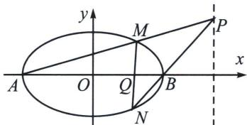

<!-- question-source:start -->
例1 (2020·新课标 I)已知 A, B 分别为椭圆 E: $\frac{x^{2}}{a^{2}} + y^{2} = 1 (a > 1)$ 的左、右顶点, G 为 E 的上顶点, $\overrightarrow{AG} \cdot \overrightarrow{GB} = 8$ . P 为直线 x = 6 上的动点, PA 与 E 的另一交点为 M, PB 与 E 的另一交点为 N.

(1)求 $E$ 的方程;

(2)证明：直线 $MN$ 过定点.

## 解析
(1) $\frac{x^2}{9} + y^2 = 1$

极点极线背景分析：MN 与 AB 交点 Q，AM 与 BN 交点 P，AN 与 BM 交点 R 构成自极三角形，根据对称性可知，PR 在直线 x=6 上，Q 为其极点，所以 $\frac{x_{P}x_{Q}}{9} + y_{P}y_{Q} = 1$ ，即 $Q\left(\frac{3}{2}, 0\right)$ .

(2)解法一(齐次化)由
(1)知 $A(-3,0)$ , $B(3,0)$ , $M(x_1,y_1)$ , $N(x_2,y_2)$ , $P(6,t)$ , 设 $k_{AM} = k_1$ , $k_{BN} = k_2$ , $k_{AN} = k_3$ , 由 $A,M,P$ 三点共线得: $k_1 = k_{PA} = \frac{t}{9}$ ; 由 $k_2 = k_{PB} = \frac{t}{3}$ ; 由 $k_{NA} \cdot k_{NB} = -\frac{1}{9}$ (第三定义, 自证), 故 $k_3 = -\frac{1}{9k_2} = -\frac{1}{3t}$ , 所以 $k_1 \cdot k_3 = k_{AM} \cdot k_{AN} = -\frac{1}{27}$ , 将坐标原点平移到 $A$ 点, 则椭圆 $E' : \frac{(x-3)^2}{9} + y^2 = 1$ , 即 $x^2 - 6x + 9y^2 = 0$ , 设直线 $M'N'$ 方程为 $mx + ny = 1$ , 代入椭圆 $E'$ 得 $x^2 - 6x (mx + ny) + 9y^2 = 0$ , 同除 $x^2$ 得 $9\left(\frac{y}{x}\right)^2 - 6n\frac{y}{x} + 1 - 6m = 0$ , 由 $k_{AM} \cdot k_{AN} = \frac{1 - 6m}{9} = -\frac{1}{27}$ , 解得 $m = \frac{2}{9}$ , 所以直线 $M'N'$ 过定点 $\left(\frac{9}{2},0\right)$ , 所以直线 $MN$ 过定点 $\left(\frac{3}{2},0\right)$ .
<!-- question-source:end -->

![[高中/总复习/专题/2026版高中《mst老唐说题》圆锥曲线专题（数学）/下册/第11章_从定比点差到极点极线/第二节_极点极线定义与自极三角形/四_完全四边形与自极三角形/例题/answers/Q00048793A1.md]]
