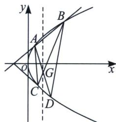
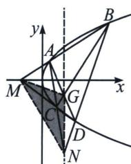

<!-- question-source:start -->
例3 (2023·福州模拟)已知抛物线 $E: y^{2} = 2px (p > 0)$ , 过点 $(-2, 0)$ 的两条直线 $l_{1}, l_{2}$ 分别交 $E$ 于 $AB$ 两点和 $C, D$ 两点. 当 $l_{1}$ 的斜率为 $\frac{2}{3}$ 时, $|AB| = \sqrt{13}$ .

(1) 求 E 的标准方程;

(2)设 G 为直线 AD 与 BC 的交点，证明：点 G 必在定直线上.

(1)当 $l_{1}$ 的斜率为 $\frac{2}{3}$ 时，得 $l_{1}$ 的方程为 $y=\frac{2}{3}(x+2)$ ，由 $\left\{\begin{aligned}y^{2}&=2px\\ y&=\frac{2}{3}(x+2)\end{aligned}\right.$ ，消去x得 $y^{2}-3py+4p=0$ ，由弦长公式得 $|AB|=\sqrt{1+\left(\frac{3}{2}\right)^{2}}\cdot\sqrt{(3p)^{2}-16p}=\sqrt{13}$ ，即 $\sqrt{(3p)^{2}-16p}=2$ ，解得p=2或 $p=-\frac{2}{9}$ （舍去），从而E的标准方程为 $y^{2}=4x$ ；

(2)极点极线背景分析: 两条直线 $l_{1}, l_{2}$ 交于点 $M: (-2, 0)$ , 此为极点, 则 $AD$ 与 $BC$ 的交点 $G$ 在其极线上, $AC$ 与 $BD$ 的交点 $N$ 也在极线上, $M、N、G$ 形成自极三角形, 故 $y_{E} y_{G} = 2 (x_{E} + x_{G})$ , 所以 $x_{G} = 2$ .

设 $A\left(\frac{y_1^2}{4}, y_1\right), B\left(\frac{y_2^2}{4}, y_2\right)$ ，得 $k_{AB} = \frac{y_2 - y_1}{\frac{y_2^2}{4} - \frac{y_1^2}{4}} = \frac{4}{y_1 + y_2}$ ，直线 $AB$ 的方程为 $y = \frac{4}{y_1 + y_2}\left(x - \frac{y_1^2}{4}\right) + y_1$ ，即 $4x - (y_1 + y_2) + y_1y_2 = 0$ ，又直线 $AB$ 过点 $(-2, 0)$ ，将该点坐标代入直线方程，得 $y_1y_2 = 8$ ，

设 $C\left(\frac{y_3^2}{4}, y_3\right), D\left(\frac{y_4^2}{4}, y_4\right)$ ，同理可得 $y_3y_4 = 8$

直线 $AD$ 的方程为 $4x - (y_{1} + y_{4})y + y_{1}y_{4} = 0①$ ，直线 $BC$ 的方程为 $4x - (y_{2} + y_{3})y + y_{2}y_{3} = 0②$

(同一转化): 直线 $AD$ 的方程为 $4x - (y_{1} + y_{4})y + y_{1}y_{4} = 0$ , 转化为 $4x - \left(\frac{8}{y_{2}} + \frac{8}{y_{3}}\right)y + \frac{64}{y_{2}y_{3}} = 0$ ,

即 $(y_{2} + y_{3})y = \frac{y_{2}y_{3}}{2} x + 8$ ，和直线 $BC$ 的方程 $(y_{2} + y_{3})y = 4x + y_{2}y_{3}$ ，联立得： $x = 2$

所以点 G 的横坐标为 2，即直线 AD 与 BC 的交点在定直线 x=2 上.
<!-- question-source:end -->

![[高中/总复习/专题/2026版高中《mst老唐说题》圆锥曲线专题（数学）/下册/第11章_从定比点差到极点极线/第二节_极点极线定义与自极三角形/四_完全四边形与自极三角形/例题/answers/Q00048795A1.md]]
