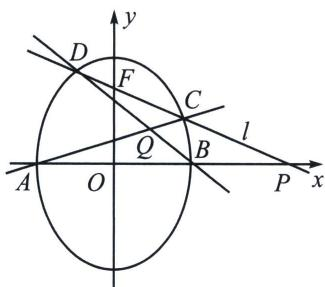
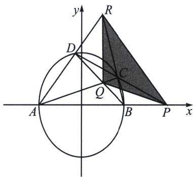

<!-- question-source:start -->
例4 (2011·四川)如图, 椭圆有两顶点 $A(-1, 0)$ 、 $B(1, 0)$ , 过其焦点 $F(0, 1)$ 的直线 $l$ 与椭圆交于 $C$ , $D$ 两点, 并与 $x$ 轴交于点 $P$ . 直线 $AC$ 与直线 $BD$ 交于点 $Q$ . 当点 $P$ 异于 $A$ , $B$ 两点时, 求证: $\overrightarrow{OP} \cdot \overrightarrow{OQ}$ 为定值.

<!-- question-source:end -->

![[高中/总复习/专题/2026版高中《mst老唐说题》圆锥曲线专题（数学）/下册/第11章_从定比点差到极点极线/第二节_极点极线定义与自极三角形/四_完全四边形与自极三角形/例题/answers/Q00048796A1.md]]
