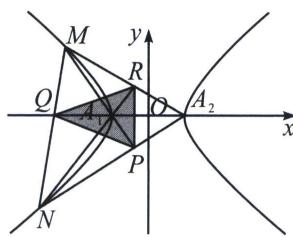

<!-- question-source:start -->
例5 (2023·新高考Ⅱ)已知双曲线C中心为坐标原点，左焦点为 $(-2\sqrt{5},0)$ ，离心率为 $\sqrt{5}$ .

(1)求 C 的方程;

(2)记 C 的左、右顶点分别为 $A_{1}$ ， $A_{2}$ ，过点 $(-4,0)$ 的直线与 C 的左支交于 M，N 两点，M 在第二象限，直线 $MA_{1}$ 与 $NA_{2}$ 交于 P，证明 P 在定直线上.

(1)双曲线 $C$ 中心为原点，左焦点为 $(-2\sqrt{5}, 0)$ ，离心率为 $\sqrt{5}$ ，则 $\left\{ \begin{array}{l} c^2 = a^2 + b^2 \\ c = 2\sqrt{5} \\ e = \frac{c}{a} = \sqrt{5} \end{array} \right.$ ，解得 $\left\{ \begin{array}{l} a = 2 \\ b = 4 \end{array} \right.$ ，

故双曲线 C 的方程为 $\frac{x^{2}}{4}-\frac{y^{2}}{16}=1$ ;

(2)由于 Q 是 $A_{1}A_{2}$ 和 MN 的交点，P 是 $MA_{1}$ 和 $NA_{2}$ 的交点，R 是 $MA_{2}$ 和 $NA_{1}$ 的交点，P、R、Q 形成自极三角形，Q 为极点，PR 为其对应极线，根据极点极线知识可得 PQ 两点符合调和共轭，即 $\frac{x_{P}x_{Q}}{4}-$

$\frac{0\times y_{P}}{16}=1$ ，所以 $x_{P}x_{Q}=4\Rightarrow x_{P}=-1$ .

<!-- question-source:end -->

![[高中/总复习/专题/2026版高中《mst老唐说题》圆锥曲线专题（数学）/下册/第11章_从定比点差到极点极线/第二节_极点极线定义与自极三角形/四_完全四边形与自极三角形/例题/answers/Q00048797A1.md]]
