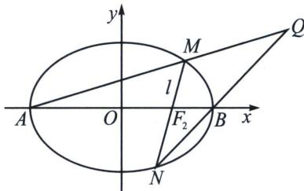

<!-- question-source:start -->
例2 已知椭圆 $C: \frac{x^2}{a^2} + \frac{y^2}{b^2} = 1 (a > b > 0)$ 的左右焦点分别为 $F_1, F_2$ ，点 $P\left(1, \frac{3}{2}\right)$ 在 $C$ 上，且 $PF_2 \perp F_2F_1$ .

(1) 求 C 的标准方程;

(2)设 C 的左右顶点分别为 A, B, O 为坐标原点，直线 l 过右焦点 $F_{2}$ 且不与坐标轴垂直，l 与 C 交于 M, N 两点，直线 AM 与直线 BN 相交于点 Q，证明点 Q 在定直线上.

##
<!-- question-source:end -->

![[高中/总复习/专题/2026版高中《mst老唐说题》圆锥曲线专题（数学）/下册/第11章_从定比点差到极点极线/第二节_极点极线定义与自极三角形/四_完全四边形与自极三角形/例题/answers/Q00053154A1.md]]
