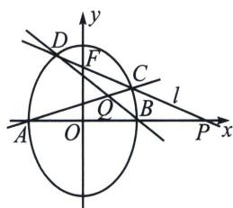

> [!faq]- 《圆锥曲线专题(下册)》例题解析
>
> > [!success]- **【答案】** 详见解析
>
> > [!note]- **【解析】**
> > 解析 [背景分析]易求得椭圆的方程为 $x^{2} + \frac{y^{2}}{2} = 1$ ，由于 $Q$ 是 $AC$ 和 $BD$ 的交点， $P$ 是 $AB$ 和 $CD$ 的交点， $R$ 是 $AD$ 和 $BC$ 的交点， $P$ 、 $R$ 、 $Q$ 形成自极三角形， $P$ 为极点， $QR$ 为其对应极线，即 $x_{P}x_{Q} + \frac{0 \times y_{Q}}{2} = 1$ ，所以 $\overrightarrow{OP} \cdot \overrightarrow{OQ} = x_{P}x_{Q} = 1$ .
> >
> > 解法一(曲线系)
> >
> > 椭圆标准方程为 $x^{2}+\frac{y^{2}}{2}=1$ 设 P 的坐标为 $(x_{P},0)$ ，Q 的坐标为 $(x_{Q},y_{Q})$ ， $l_{AC}:x=k_{1}y-1$ ， $l_{BD}:x=k_{2}y+1$ ， $l_{CD}:\frac{x}{x_{P}}+y=1$ ，因为椭圆过二次曲线 AC，BD 与二次曲线 AB，CD 的四个交点 A，C，B，D 有：
> > 四点的曲线系方程为 $(x-k_{1}y+1)(x-k_{2}y-1)+\mu y\left(\frac{x}{x_{P}}+y-1\right)=\lambda(x^{2}+\frac{y^{2}}{2}-1)$ ,
> >
> > xy 的系数： $-k_{1}-k_{2}+\frac{\mu}{x_{P}}=0$ ，y 的系数： $k_{1}-k_{2}-\mu=0$ ，联立 $\left\{\begin{aligned}l_{AC}:&x=k_{1}y-1\\ l_{BD}:&x=k_{2}y+1\end{aligned}\right.$ ，解得 $(k_{1}-k_{2})x_{Q}=k_{1}+k_{2}$ ， $x_{Q}=\frac{1}{x_{p}}$ ，则 $\overrightarrow{OP}\cdot\overrightarrow{OQ}=x_{P}\cdot x_{Q}=1$ 。
> >
> > 
> >
> > 解法二：齐次化
> >
> > 因为 $k_{BD} \cdot k_{AD} = -2$ (第三定义)，令 $x_{Q} = n, P(m, 0)$ ，且 $\left\{ \begin{array}{l} k_{AQ} = k_{AC} \\ k_{BQ} = k_{BD} \end{array} \right.$ ， $\frac{k_{AQ}}{k_{BQ}} = \frac{x_Q - 1}{x_Q + 1} = \frac{n - 1}{n + 1}$ ，
> >
> > 所以 $\frac{k_{AC} \cdot k_{AD}}{k_{BD} \cdot k_{AD}} = \frac{n - 1}{n + 1} \Rightarrow k_{AC} \cdot k_{AD} = -\frac{2(n - 1)}{n + 1}$ ，将椭圆向右平移1个单位，得 $(x - 1)^2 + \frac{y^2}{2} = 1$
> >
> > $C^{\prime}D^{\prime}:\frac{1}{m+1}x+qy=1$ ，联立即 $x^{2}+\frac{y^{2}}{2}-2x\left(\frac{1}{m+1}x+qy\right)=0$ ，同除以 $x^{2}$ ，即 $\frac{1}{2}\left(\frac{y}{x}\right)^{2}-2q\frac{y}{x}+1-\frac{2}{m+1}=0$ ，由于 $k_{1}k_{2}=k_{AD}k_{AC}=\frac{1-\frac{2}{m+1}}{\frac{1}{2}}=-\frac{2(n-1)}{n+1}$ ，所以 $\overrightarrow{OP}\cdot\overrightarrow{OQ}=m\cdot n=1$ 。
> >
> > 解法三：定比点差
> >
> > 令 $P(m,0)$ ，且 $\overrightarrow{CP} = \lambda \overrightarrow{PD}$ ， $\left\{ \begin{array}{l}x_{C} = \frac{m + \frac{1}{m}}{2} +\frac{m - \frac{1}{m}}{2}\lambda \\ y_{C} + \lambda y_{D} = 0\\ x_{D} = \frac{m + \frac{1}{m}}{2} +\frac{m - \frac{1}{m}}{2\lambda} \end{array} \right.$ ，A、C、Q三点共线，故 $\frac{y_C}{x_C + 1} = \frac{y_Q}{x_Q + 1},B,D,Q$
> >
> > 三点共线，故 $\frac{y_D}{x_D - 1} = \frac{y_Q}{x_Q - 1}$ ，两式相除消掉 $y_{Q}$ 得： $\frac{y_C(x_Q + 1)}{x_C + 1} = \frac{y_D(x_Q - 1)}{x_D - 1}$ ，所以 $x_{Q} = \frac{1}{m}$ ，所以 $\overrightarrow{OP} \cdot \overrightarrow{OQ} = 1$ .
> > 解法四：两点对合式方程
> >
> > 令 $C: (\cos \theta_1, \sqrt{2} \sin \theta_1), t_1 = \tan \frac{\theta_1}{2}, D: (\cos \theta_2, \sqrt{2} \sin \theta_2), t_2 = \tan \frac{\theta_2}{2}, k_{AC} = \sqrt{2} t_1, k_{BD} = -\frac{\sqrt{2}}{t_2},$ $\left\{ \begin{array}{l} AC: y = \sqrt{2} t_1(x + 1) \\ BD: y = -\frac{\sqrt{2}}{t_2}(x - 1) \end{array} \Rightarrow Q: \left(\frac{1 - t_1 t_2}{1 + t_1 t_2}, \frac{2\sqrt{2}}{1 + t_1 t_2}\right), CD: x(1 - t_1 t_2) + \frac{y}{\sqrt{2}} (t_1 + t_2) = 1 + t_1 t_2$ （自证）， $x_P = \frac{1 + t_1 t_2}{1 - t_1 t_2}$ ，所以 $\overrightarrow{OP} \cdot \overrightarrow{OQ} = 1.$
