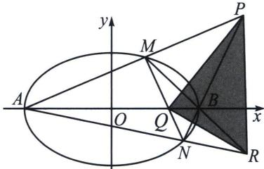

> [!faq]- 《圆锥曲线专题(下册)》例题解析
>
> > [!success]- **【答案】** 详见解析
>
> > [!note]- **【分析】**
> > MN 与 AB 交点 Q，AM 与 BN 交点 P，AN 与 BM 交点 R 构成自极三角形，根据对称性可知，PR 在直线 x=6 上，Q 为其极点，所以 $\frac{x_{P}x_{Q}}{9} + y_{P}y_{Q} = 1$ ，即 $Q\left(\frac{3}{2}, 0\right)$ .
>
> > [!note]- **【解析】**
> > 
> > (2)
> > 解法一(齐次化)由(1)知 $A(-3,0)$ , $B(3,0)$ , $M(x_1,y_1)$ , $N(x_2,y_2)$ , $P(6,t)$ , 设 $k_{AM} = k_1$ , $k_{BN} = k_2$ , $k_{AN} = k_3$ , 由 $A,M,P$ 三点共线得: $k_1 = k_{PA} = \frac{t}{9}$ ; 由 $k_2 = k_{PB} = \frac{t}{3}$ ; 由 $k_{NA} \cdot k_{NB} = -\frac{1}{9}$ (第三定义, 自证), 故 $k_3 = -\frac{1}{9k_2} = -\frac{1}{3t}$ , 所以 $k_1 \cdot k_3 = k_{AM} \cdot k_{AN} = -\frac{1}{27}$ , 将坐标原点平移到 $A$ 点, 则椭圆 $E' : \frac{(x-3)^2}{9} + y^2 = 1$ , 即 $x^2 - 6x + 9y^2 = 0$ , 设直线 $M'N'$ 方程为 $mx + ny = 1$ , 代入椭圆 $E'$ 得 $x^2 - 6x (mx + ny) + 9y^2 = 0$ , 同除 $x^2$ 得 $9\left(\frac{y}{x}\right)^2 - 6n\frac{y}{x} + 1 - 6m = 0$ , 由 $k_{AM} \cdot k_{AN} = \frac{1 - 6m}{9} = -\frac{1}{27}$ , 解得 $m = \frac{2}{9}$ , 所以直线 $M'N'$ 过定点 $\left(\frac{9}{2},0\right)$ , 所以直线 $MN$ 过定点 $\left(\frac{3}{2},0\right)$ .
> > 解法二(曲线系): 设 $P(6, y_0)$ , 因为 $A(-3, 0)$ , $B(3, 0)$ ,
> > 则直线 $PA$ 的方程可以表示为 $x = k_{1}y - 3 = \frac{9}{y_{0}} y - 3$ ，直线 $PB$ 的方程可以表示为 $x = k_{2}y + 3 = \frac{3}{y_{0}} y + 3$ ，易知 $k_{1} = 3k_{2}$ ，设直线 $MN$ 的方程为 $x - ky - m = 0$ ，故经过 $A, B, M, N$ 四点的曲线系可表示为 $y(x - ky - m) + \lambda (x - 3k_{2}y + 3)(x - k_{2}y - 3) = \mu \left(\frac{x^{2}}{9} + y^{2} - 1\right)$ ，
> > - **①**：比较“xy”项的系数 $1-4\lambda k_{2}=0$ ，②比较“y”项的系数 $-m+6\lambda k_{2}=0$ ，
> > 两式比较得 $m=\frac{3}{2}$ ，故直线 MN 过 $\left(\frac{3}{2},0\right)$ .
> > 注意 参考上一章节的两点对合式，顶点弦的翻译角度很多，这也是一个常见题型.
