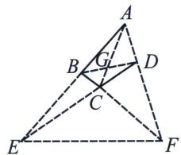
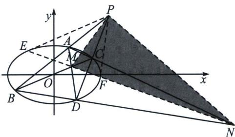

## 四、完全四边形与自极三角形

## 1. 完全四边形定义

完全四边形两两相交, 如下图的四边形 $ABCD$ , 没有三线共点的四条直线 $AB$ 、 $BC$ 、 $CD$ 、 $DA$ , 及它们的六个交点, $ABE$ , $ADF$ , $BCF$ , $DCE$ 两两相交于 $A$ , $B$ , $C$ , $D$ , $E$ , $F$ 六点, 六个点可分成三对相对的顶点, 它们的连线 $AC$ , $BD$ , $EF$ 是三条对角线. 则 $ABCDEF$ 即为完全四边形

## 2. 极点极线的综合模型——自极三角形

极点极线的几何意义：

(1)若点 P 是圆锥曲线上的点，则过点 P 的切线即为极点 p 对应的极线.

(2)如图所示(以椭圆图形为例), 若点 $P$ 是不在圆锥曲线上的点, 且不为原点 $O$ , 过点 $P$ 作割线 $PAB$ 、 $PCD$ 依次交圆锥曲线于 $A$ 、 $B$ 、 $C$ 、 $D$ 四点, 连结直线 $AD$ 、 $BC$ 交于点 $M$ , 连结直线 $AC$ 、 $BD$ 交于点 $N$ , 则直线 $l_{MN}$ 为极点 $P$ 对应的极线. 类似的, 也可得到极点 $N$ 对应的极线为直线 $l_{PM}$ , 极点 $M$ 对应的极线为直线 $l_{PN}$ , 因此, 我们把 $\triangle PMN$ 称为自极三角形. 【即 $\triangle PMN$ 的任一顶点作为极点, 则顶点对应的边即为对应的极线, “补全自极三角形”这个技巧很常用, 后面结合例题了解!】

如图所示, 如果我们连结直线 $NM$ 交圆锥曲线于点 $E 、 F$ , 则直线 $PE 、 PF$ 恰好为圆锥曲线的两条切线, 此时, 直线 $l_{EF}$ 不仅是极点 $P$ 的极线, 我们也称直线 $l_{EF}$ 为渐切线.

下面的共轭点模型，实际都是极点在坐标轴上的特例模型的应用，也是高考题常见.

![[高中/总复习/专题/2026版高中《mst老唐说题》圆锥曲线专题（数学）/下册/第11章_从定比点差到极点极线/第二节_极点极线定义与自极三角形/四_完全四边形与自极三角形/例题/Q00053153.md]]
![[高中/总复习/专题/2026版高中《mst老唐说题》圆锥曲线专题（数学）/下册/第11章_从定比点差到极点极线/第二节_极点极线定义与自极三角形/四_完全四边形与自极三角形/例题/Q00053154.md]]
![[高中/总复习/专题/2026版高中《mst老唐说题》圆锥曲线专题（数学）/下册/第11章_从定比点差到极点极线/第二节_极点极线定义与自极三角形/四_完全四边形与自极三角形/例题/Q00053155.md]]
![[高中/总复习/专题/2026版高中《mst老唐说题》圆锥曲线专题（数学）/下册/第11章_从定比点差到极点极线/第二节_极点极线定义与自极三角形/四_完全四边形与自极三角形/例题/Q00048796.md]]
![[高中/总复习/专题/2026版高中《mst老唐说题》圆锥曲线专题（数学）/下册/第11章_从定比点差到极点极线/第二节_极点极线定义与自极三角形/四_完全四边形与自极三角形/例题/Q00053156.md]]
