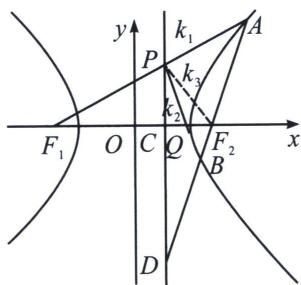

<!-- question-source:start -->
例2 (24 武汉二调 18 题) 已知双曲线 $E: \frac{x^{2}}{a^{2}} - \frac{y^{2}}{b^{2}} = 1$ 的左右焦点为 $F_{1}, F_{2}$ , 其右准线为 $l$ , 点 $F_{2}$ 到直线 $l$ 的距离为 $\frac{3}{2}$ , 过点 $F_{2}$ 的动直线交双曲线 $E$ 于 $A, B$ 两点, 当直线 $AB$ 与 $x$ 轴垂直时, $|AB| = 6$ .

(1)求双曲线 E 的标准方程;

(2)设直线 $AF_{1}$ 与直线 l 的交点为 P，证明：直线 PB 过定点.

## 解析
(1) $x^{2} - \frac{y^{2}}{3} = 1$

(2)极点极线背景: 由对称性可知, 定点在 $x$ 轴上, 设定点为 $Q(x_0, 0)$ , 点 $F_2$ 的极线即为右准线为 $l$ , 其与 $x$ 轴交点 $C$ , $PC$ 与 $AB$ 交于点 $D$ ,

方案一(交比不变性): $P(A, B; F_2, D) = P(F_1, Q; F_2, C) = -1$ , 所以 $\frac{F_1F_2}{F_2Q} = \frac{F_1C}{CQ}$ , 所以 $\frac{2 - (-2)}{2 - x_Q}$ $= \frac{\frac{1}{2} - (-2)}{x_Q - \frac{1}{2}}$ 解得 $x_Q = \frac{14}{13}$ , 也可以利用 $\frac{2}{F_1Q} = \frac{1}{F_1F_2} + \frac{1}{F_1C}$ , 算出 $x_Q = \frac{14}{13}$ ;

方案二(调和线束斜率公式): (A, B; $F_{2}$ , D) = -1，则 PA、PB、 $PF_{2}$ 、PD 为调和线束，分别记它们斜率为 $k_{1}$ 、 $k_{2}$ 、 $k_{3}$ 、 $k_{4}$ ，由于 $k_{4} = \infty$ ，所以 $k_{1} + k_{2} = 2k_{3}$ ; $-2 \cdot \frac{PC}{CF_{2}} = \frac{PC}{F_{1}C} + \frac{-PC}{CQ}$ ，所以 $x_{Q} = \frac{14}{13}$ ;

书写过程： $A(x_{1},y_{1}),B(x_{2},y_{2}),F_{2}(2,0)$ ，设 $\overrightarrow{AF_2} = \lambda \overrightarrow{F_2B}$ ，且点 $D$ ，使得 $\overrightarrow{AD} = -\lambda \overrightarrow{DB}$ ，所以 $\left\{ \begin{array}{l}\frac{x_1 + \lambda x_2}{1 + \lambda} = x_{F_2} = 2\\ \frac{y_1 + \lambda y_2}{1 + \lambda} = y_{F_2} = 0 \end{array} \right.$ ，故 $\left\{ \begin{array}{l}\frac{x_1 - \lambda x_2}{1 - \lambda} = x_D\\ \frac{y_1 - \lambda y_2}{1 - \lambda} = y_D \end{array} \right.$ ，两式相减得： $\frac{(x_1 + \lambda x_2)(x_1 - \lambda x_2)}{(1 + \lambda)(1 - \lambda)} -\frac{(y_1 + \lambda y_2)(y_1 - \lambda y_2)}{3(1 + \lambda)(1 - \lambda)} =$

1, 即 $x_{D} = \frac{1}{2}$ ,

所以 $\left\{ \begin{array}{l} x_{1} + \lambda x_{2} = 2(1 + \lambda) \\ x_{1} - \lambda x_{2} = \frac{1}{2}(1 - \lambda), \\ y_{1} + \lambda y_{2} = 0 \end{array} \right.$ 即 $\left\{ \begin{array}{l} x_{1} = \frac{5}{4} + \frac{3}{4}\lambda \\ x_{2} = \frac{5}{4} + \frac{3}{4\lambda}, \\ y_{1} + \lambda y_{2} = 0 \end{array} \right.$ , $A(x_{1},y_{1})$ 、 $P\left(\frac{1}{2},y_{P}\right)$ 、 $F_{1}(-2,0)$ 三点共线，则 $\frac{y_{P}}{\frac{1}{2} + 2} = \frac{y_{1}}{x_{1} + 2}$ ，所以 $y_{P} = \frac{10y_{1}}{13 + 3\lambda}$ ①，根据 $AB$ 上下对称性（ $AB$ 可轮换上下对称）可知， $PB$ 过的定点在 $x$ 轴上，设为点 $Q(t,0)$ ， $B(x_{2},y_{2})$ 、 $P\left(\frac{1}{2},y_{P}\right)$ 、 $Q(t,0)$ 三点共线，则 $\frac{y_{P}}{\frac{1}{2} - t} = \frac{y_{2}}{x_{2} - t} \Rightarrow \frac{10y_{1}}{(13 + 3\lambda)\left(\frac{1}{2} - t\right)} = \frac{y_{1}}{-\lambda\left(\frac{5}{4} + \frac{3}{4\lambda} - t\right)}$ , $t = \frac{14}{13}$ ，故直线 $PB$ 过定点过 $Q: \left(\frac{14}{13},0\right)$ .
<!-- question-source:end -->
