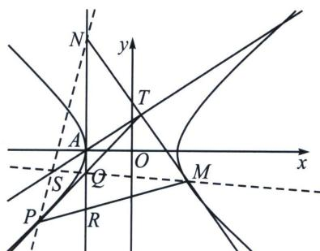

<!-- question-source:start -->
例3（25武汉二调19题）双曲线 $E: \frac{x^2}{a^2} - \frac{y^2}{b^2} = 1 (a > 0, b > 0)$ 的一个顶点在直线 $l: y = x + 1$ 上，且其离心率为 $\sqrt{5}$ .

(1)求双曲线 E 的标准方程;

(2)若一条直线与双曲线恰有一个公共点, 且该直线与双曲线的渐近线不平行, 则定义该直线为双曲线的切线, 定义该公共点为切线的切点. 已知点 $T$ 在直线 $l$ 上, 且过点 $T$ 恰好可作双曲线 $E$ 的两条切线, 设这两条切线的切点分别为 $P$ 和 $M$ .

(i) 设点 T 的横坐标为 t，求 t 的取值范围；

（ii）设直线 TP 和直线 TM 分别与直线 x = -1 交于点 Q 和点 N，证明：直线 PN 和直线 MQ 的交点在定直线上.

（附：双曲线 $\frac{x^2}{a^2} -\frac{y^2}{b^2} = 1$ 以点 $(m,n)$ 为切点的切线方程为 $\frac{m}{a^2} x - \frac{n}{b^2} y = 1)$

(1) $x^{2} - \frac{y^{2}}{4} = 1$

(2)(i)(t, t+1)在切点弦 $xx_{T}-\frac{yy_{T}}{4}=1$ 上，所以 $tx-\frac{(t+1)y}{4}=1$ ，过定点 $R(-1,-4)$ （调和共轭属性），联立 $\left\{\begin{aligned} &tx-\frac{(t+1)y}{4}=1 \\ &x^{2}-\frac{y^{2}}{4}=1\end{aligned}\right.$ $\Delta=16\left[4-\left(\frac{4t}{t+1}\right)^{2}+\left(\frac{4}{t+1}\right)^{2}\right]>0\Rightarrow-1<t<\frac{5}{3}$ 且 $t\neq1$ ， $t\neq-\frac{1}{3}$ （渐近线）

(ii)(两点对合方程): 令 $P\left(\frac{1}{\cos(-\theta_1)}, \frac{2\sin(-\theta_1)}{\cos(-\theta_1)}\right)$ (位于左支), $M\left(\frac{1}{\cos\theta_2}, \frac{2\sin\theta_2}{\cos\theta_2}\right)$ (位于右支), 由于 $\cos\theta_1\cos\frac{\theta_1+\theta_2}{2}+\sin\theta_1\sin\frac{\theta_1+\theta_2}{2}=\cos\frac{\theta_1-\theta_2}{2}$ ,

$$
\cos \theta_ {2} \cos \frac {\theta_ {1} + \theta_ {2}}{2} + \sin \theta_ {2} \sin \frac {\theta_ {1} + \theta_ {2}}{2} = \cos \frac {\theta_ {1} - \theta_ {2}}{2},
$$

故 $P\left(\frac{1}{\cos(-\theta_1)}, \frac{2\sin(-\theta_1)}{\cos(-\theta_1)}\right), M\left(\frac{1}{\cos\theta_2}, \frac{2\sin\theta_2}{\cos\theta_2}\right)$ ，均在对合方程 $x\cos \frac{\theta_1 + \theta_2}{2} - \frac{y}{2}\sin \frac{-\theta_1 + \theta_2}{2} = \cos \frac{\theta_1 - \theta_2}{2}$ 上，即弦 $PM$ 的对合方程是： $x\cos \frac{\theta_1 + \theta_2}{2} - \frac{y}{2}\sin \frac{-\theta_1 + \theta_2}{2} = \cos \frac{\theta_1 - \theta_2}{2}$ ，令 $t_1 = \tan \left(-\frac{\theta_1}{2}\right), t_2 = \tan \frac{\theta_2}{2}$ ，所以 $PM: x(1 + t_1t_2) - \frac{y}{2}(t_1 + t_2) = 1 - t_1t_2$ ，由于过点 $(-1, -4)$ ，所以 $t_1 + t_2 = 1$ ， $TP: \frac{x}{\cos(-\theta_1)} - \frac{y\sin(-\theta_1)}{2\cos(-\theta_1)} = 1$ ，所以 $Q: (-1, \frac{2\cos(-\theta_1) + 2}{-\sin(-\theta_1)})$ ，即 $(-1, \frac{-2}{t_1})$ ，

TM: $\frac{x}{\cos\theta_{2}}-\frac{y\sin\theta_{2}}{2\cos\theta_{2}}=1$ ，所以 N: $\left(-1,\frac{2\cos\theta_{2}+2}{-\sin\theta_{2}}\right)$ ，即 $\left(-1,\frac{-2}{t_{2}}\right)$ ,

$\left\{ \begin{array}{l} S、Q、M 三点共线： \frac {y _ {0} + \frac {2}{t _ {1}}}{x _ {0} + 1} = \frac {\frac {2}{t _ {1}} + \frac {2 \sin \theta _ {2}}{\cos \theta _ {2}}}{1 + \frac {1}{\cos \theta _ {2}}} = \frac {1 + 2 t _ {1} t _ {2} - t _ {2} ^ {2}}{t _ {1}} \\ S、P、N 三点共线： \frac {y _ {0} + \frac {2}{t _ {2}}}{x _ {0} + 1} = \frac {\frac {2}{t _ {2}} + \frac {2 \sin (- \theta_ {1})}{\cos (- \theta_ {1})}}{1 + \frac {1}{\cos (- \theta_ {1})}} = \frac {1 + 2 t _ {1} t _ {2} - t _ {1} ^ {2}}{t _ {2}} \end{array} , \right.$ 所以 $\left\{ \begin{array}{l} t _{1} y _{0} + 2 = (x _{0} + 1)(1 + 2 t _{1} t _{2} - t _{2} ^{2}) \\ t _{2} y _{0} + 2 = (x _{0} + 1)(1 + 2 t _{1} t _{2} - t _{1} ^{2}) \end{array} \right.$

两式相减，得： $(t_1 - t_2)y_0 = (x_0 + 1)(t_1^2 -t_2^2)$ ，所以 $y_{0} = x_{0} + 1$

极点极线背景: (对合)以 $R(-1, -4)$ 为对合中心, 则 $AT: y = x + 1$ ( $R$ 的极线)为对合轴, $P$ 、 $M$ 是关于 $AT$ 的一组对合, 同理 $QN$ 也是关于对合轴的一组对合, 所以 $PN$ 和 $MQ$ 也关于对合轴的一组对合, 它们交点一定在对合轴 $AT: y = x + 1$ 上.

注意 本题利用同构解对合方程或者非轴点弦来解效果是一样的，两点对合式，从头对称到尾，看上去有书写过程，其实计算量很小。
<!-- question-source:end -->

![[高中/总复习/专题/2026版高中《mst老唐说题》圆锥曲线专题（数学）/下册/第12章_调和点列与调和线束定理与对合关系/第一节_调和点列与点的对合/例题/answers/Q00048806A1.md]]
