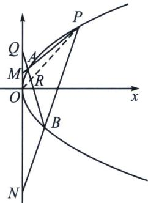

<!-- question-source:start -->
例1 (2018·北京理)已知抛物线 $C: y^{2} = 2px$ 经过点 $P(1, 2)$ , 过点 $Q(0, 1)$ 的直线 $l$ 与抛物线 $C$ 有两个不同的交点 $A, B$ , 且直线 $PA$ 交 $y$ 轴于 $M$ , 直线 $PB$ 交 $y$ 轴于 $N$ .

(1)求直线 l 的斜率的取值范围;

(2)设 O 为原点， $\overrightarrow{QM}=\lambda\overrightarrow{QO}$ ， $\overrightarrow{QN}=\mu\overrightarrow{QO}$ 求证： $\frac{1}{\lambda}+\frac{1}{\mu}$ 为定值.

<!-- question-source:end -->

![[高中/总复习/专题/2026版高中《mst老唐说题》圆锥曲线专题（数学）/下册/第12章_调和点列与调和线束定理与对合关系/第一节_调和点列与点的对合/例题/answers/Q00053161A1.md]]
