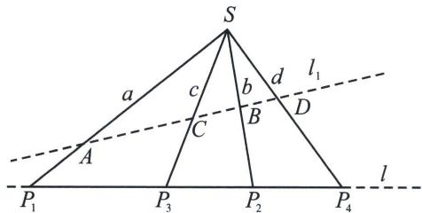
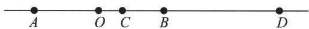
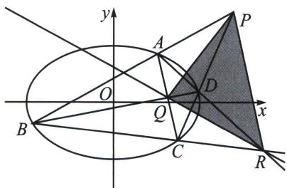
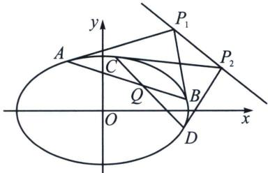

## 第一节 调和点列与点的对合

根据完全四边形中的调和点列可知，完全四边形的任意一条对角线的两端，都被它和另外两条对角线的交点所调和分割。如果我们以 S 点为射影中心， $P_{1}$ ， $P_{2}$ ， $P_{3}$ ， $P_{4}$ 为调和点列，利用交比不变性，如下图， $(P_{1}P_{2}, P_{3}P_{4}) = (AB, CD) = -1$ ，

则 $SP_{1}$ ， $SP_{2}$ ， $SP_{3}$ ， $SP_{4}$ 均为 S 点的调和线束.

调和点列的数量关系

如下图所示：对于线段 $AB$ 的内分点 $C$ 和外分点 $D$ 满足 $C$ 、 $D$ 调和分割线段 $AB$ ，即 $\frac{AC}{CB} = \frac{AD}{DB}$ ，设 $O$ 为线段 $AB$ 的中点，则有以下结论成立：

①点 A、B 也调和分割 C、D，即 $\frac{CA}{AD} = \frac{CB}{BD}$ ;

② $\frac{2}{AB}=\frac{1}{AC}+\frac{1}{AD}$ (AB 是 AC 与 AD 的调和平均数).

证明：令 $|AB|=t,\quad|AC|=\frac{\lambda t}{1+\lambda},\quad|AD|=\frac{-\lambda t}{1-\lambda}$ ，所以 $\frac{2}{AB}=\frac{1}{AC}+\frac{1}{AD}$ .

注意 调和点列的数量关系在推导调和线束斜率公式起到很关键作用.

## 调和共轭定理

若 $P Q$ 两点符合调和共轭, 比如椭圆中 $\frac { x _ { P } x _ { Q } } { a ^ { 2 } } + \frac { y _ { P } y _ { Q } } { b ^ { 2 } } = 1$ , 那么点 $P$ 为极点, 点 $Q$ 一定在其对应极线上, 同理, 点 $Q$ 为极点, 则点 $P$ 一定在其对应极线上.

## 高中数学 新思路 圆锥专题

我们用自极三角形来理解这个问题，在完全四边形 ABCDPR 中，PQR 为自极三角形，P 为极点，则 QR 为极线，Q 一定位于极线上，同理，Q 为极点，PR 为极线，P 一定位于极线上.

我们还能发现 RQ 作为对合轴，P 作为对合中心，此时 A 与 B 对合，C 与 D 对合.

以 PQ 作为对合轴，R 作为对合中心，此时 A 与 D 对合，B 与 C 对合.

以 PR 作为对合轴，Q 作为对合中心，此时 A 与 C 对合，B 与 D 对合.

按照相同逻辑，若点 P 在某条定直线上运动，则 P 为极点对应的极线一定过定点 Q，反之亦然，此为极点极线的对偶性质.

如图, 若 $P$ 在一条定直线上运动, 则 $P_{1}$ 的极线 (切点弦) $A B$ , 与 $P_{2}$ 的极线 (切点弦) $C D$ 相交于定点 $Q$ , 则 $Q$ 是直线 $P_{1} P_{2}$ 为极线对应的极点, 这也意味着 $P_{1} P_{2}$ 上任意一点作为极点的极线都过 $Q$ , $A B$ 是一种对合 (两点轮换, 用 $B$ 表示 $A$ 和用 $A$ 表示 $B$ 是一样的), $A B$ 过定点 $Q$ , 那么 $Q$ 是对合中心, 直线 $P_{1} P_{2}$ 是对合轴, $C D$ 也是一种对合, $Q$ 是对合中心, 直线 $P_{1} P_{2}$ 是对合轴, 这也充分解释了, 极点极线理论的前身就是笛沙格射影几何学的对合体系.

![[高中/总复习/专题/2026版高中《mst老唐说题》圆锥曲线专题（数学）/下册/第12章_调和点列与调和线束定理与对合关系/第一节_调和点列与点的对合/例题/Q00048804.md]]
![[高中/总复习/专题/2026版高中《mst老唐说题》圆锥曲线专题（数学）/下册/第12章_调和点列与调和线束定理与对合关系/第一节_调和点列与点的对合/例题/Q00048805.md]]
![[高中/总复习/专题/2026版高中《mst老唐说题》圆锥曲线专题（数学）/下册/第12章_调和点列与调和线束定理与对合关系/第一节_调和点列与点的对合/例题/Q00048806.md]]
