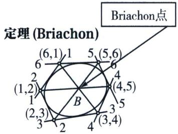
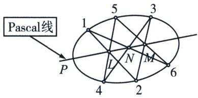
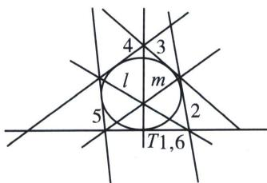
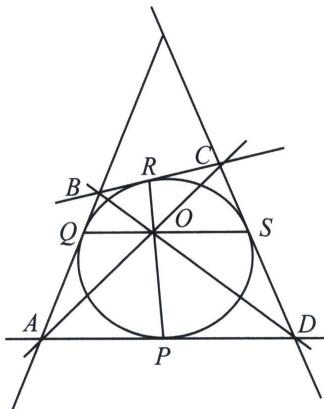
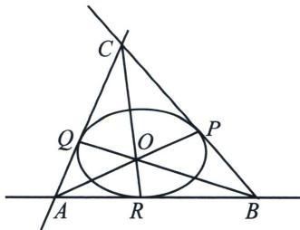

## 一、布利安桑(Brianchon)定理与退化二次曲线联立

如果直线 1, 2, 3, 4, 5, 6 是二阶线束的任何六条射线，则直线 $l = (12, 45)$ ， $m = (23, 56)$ ，

$n = (34, 61)$ 交于一个共同点．此点叫 Brianchon 点，六条射线构成的六边形叫 Brianchon 六线形（六边形）．以上定理的陈述中，12 代表直线 1 与直线 2 的交点，45 代表直线 4 与直线 5 的交点，而 $l = (12, 45)$ 代表 12 与 45 两个交点的连线， $m = (23, 56)$ ， $n = (34, 61)$ 的意义类似.

Brianchon 定理是 Pascal 定理的对偶命题，一般书中通常不再给出独立证明。如果要证，其形式也和 Pascal 定理的证明完全相似。所以这里也不再进行。

## 1. 对偶的两个定理——布利安桑定理与帕斯卡定理比较

<table><tr><td>Brianchon 定理:</td><td>Pascal 定理:</td></tr><tr><td>设  $a, b, c, d, e, f$  是二阶线束中的任何六条线,设 $l$  是  $a, b$  交点与  $d, e$  交点的连线, $m$  是  $b, c$  交点与  $e, f$  交点的连线, $n$  是  $c, d$  交点与  $f, a$  交点的连线,则  $l, m, n$  三线共点.此点称 Brianchon 点,六线构成的图形叫 Brianchon 六线形.</td><td>设  $A, B, C, D, E, F$  是二阶点列中的任何六个点,设 $L$  是  $A, B$  连线与  $D, E$  连线的交点, $M$  是  $B, C$  连线与  $E, F$  连线的交点, $N$  是  $C, D$  连线与  $F, A$  连线的交点,则  $L, M, N$  三点共线.此线称 Pascal 线,六点构成的图形叫 Pascal 六点形.</td></tr></table>

可以看出，只要把“点”和“线”两字互换，“交点”和“连线”两单字互换。则 Pascal 定理就与 Brianchon 定理的形式惊人地一致了。

Brianchon 定理也可陈述如下：圆锥曲线外切六边形的三组对顶点的连线交于同一点.

## 2. 外切五边形的布利安桑点

如果直线 2 趋近直线 1，并达到直线 1 的极限位置，则直线 1 与直线 2 的交点 $(1, 2)$ 以曲线在 1 的切点作为极限位置。如图，已知直线 1, 2, 3, 4, 5，求 $1 (=6)$ 的切点的步骤如下：作直线 $l = (12, 45)$ ， $m = (23, 56)$ ，则连线 $(34, lm)$ 与直线 1 交点必为所求的切点 T。

  
外切于圆锥曲线的五边形

## 3. 外切四边形的布利安桑点

如果 Brianchon 定理中的六边形有两对邻边相重合，则六边形退化成为四边形。有关这种外切于圆锥曲线的四边形，我们有下面的定理：

外切于圆锥曲线的四边形ABCD的两组对顶点连线 $BD$ ，AC，以及两组对切点连线PR与QS，四线交于一个共同的点.

证明：令过切点 $P$ 的切线为1和6的重合，过切点 $R$ 的切线为3和4的重合，再令 $Q$ 点切线为5， $S$ 点切线为2，则

直线 $l = (12, 45) = BD$

直线 $m=(23,56)=AC$

直线 $n=(34,16)=RP$ 三线共点.

下面再证 SQ 也与上面三线共点:

令 Q 的切线为 1, 6 重合, S 的切线为 3, 4 重合, P 点切线为 5, R 点切线为 2, 则

直线 $l=(12,45)=BD$

直线 $m=(23,56)=AC$

直线 $n=(34,16)=SQ$ 三线也共点，

由此 BD, AC, PR, SQ 四线共点, 即定理所要证的.

  
外切于圆锥曲线的四边形

## 4. 外切三边形的布利安桑点

六边形也可能进一步退化成为一个三边形，这时 Brianchon 定理给出以下形式(证明留给大家):

外切于圆锥曲线的三角形的三个顶点与对边上的切点的连线交于同一点.

  
外切于圆锥曲线的三角形
