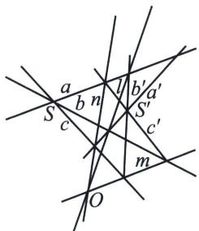

## 三、退化二次曲线的布利安桑点

Brianchon 定理也可应用于由两点 S， $S'$ 以及通过它们的所有直线组成的退化圆锥曲线：

如果 a, b, c 是通过点 S 的三条直线， $a'$ ， $b'$ ， $c'$ 是通过另一点 $S'$ 的三条直线，则 $l=(ab', a'b)$ ， $m=(bc', b'c)$ 和 $n=(ca', c'a)$ 三条直线交于一点.

圆锥曲线的退化情况 l, m, n 交于一个共同的 O 点
