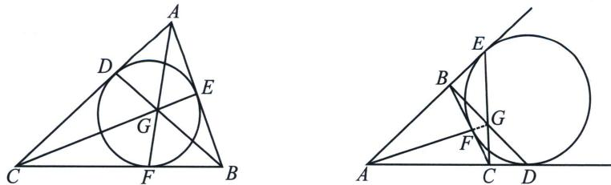
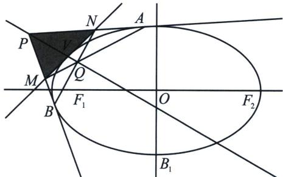

## 二、热尔岗点

热尔岗点，也称Gergonne的内点或内心，是法国数学家Gergonne在1816年提出的一个特殊的点。热尔岗点在平面几何中是一个重要的概念，被广泛应用于许多领域，包括计算机图形学、机器人学、凸包算法等。

热尔岗点是三角形三条边与其内切圆或旁切圆的切点所连成的三条直线的交点。具体来说，如果 $X$ 、 $Y$ 、 $Z$ 分别是 $\triangle ABC$ 的三边 $BC$ 、 $CA$ 、 $AB$ 与其内切圆或旁切圆的切点，则三线 $AX$ 、 $BY$ 、 $CZ$ 共点，这样的点共有四个，称为 $\triangle ABC$ 的热尔岗点。

该点被法国数学家热尔岗发现，因为一个三角形有一个内切圆和三个旁切圆，所以一个三角形有四个热尔岗点.

以三角形内部热尔岗点为例，证明：AF，BD，CE 共点.

证明: 如图所示, 根据切线长定理有 $AD = AE$ , $BE = BF$ , $CD = CF$ , 则 $\frac{AD}{DC} \cdot \frac{BE}{EA} \cdot \frac{CF}{FB} = 1$

由塞瓦定理知：AF，BD，CE 共点.

如下图， $MNV$ 可以是曲线上任意一点的切线，如图我们始终有 $BN$ 与 $AB$ 的交点 $Q$ 落在 $PV$ 直线上

![[高中/总复习/专题/2026版高中《mst老唐说题》圆锥曲线专题（数学）/下册/第12章_调和点列与调和线束定理与对合关系/第七节_帕斯卡定理与对偶定理布利安桑定理/二_热尔岗点/例题/Q00053216.md]]
