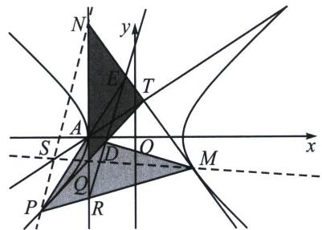

<!-- question-source:start -->
例1 (25 武汉二调 19 题) 双曲线 $E: \frac{x^{2}}{a^{2}} - \frac{y^{2}}{b^{2}} = 1 (a > 0, b > 0)$ 的一个顶点在直线 $l: y = x + 1$ 上，且其离心率为 $\sqrt{5}$ .

(1)求双曲线 E 的标准方程;

(2)若一条直线与双曲线恰有一个公共点, 且该直线与双曲线的渐近线不平行, 则定义该直线为双曲线的切线, 定义该公共点为切线的切点. 已知点 $T$ 在直线 $l$ 上, 且过点 $T$ 恰好可作双曲线 $E$ 的两条切线, 设这两条切线的切点分别为 $P$ 和 $M$ .

(i)设点 T 的横坐标为 t，求 t 的取值范围；

(ii) 设直线 TP 和直线 TM 分别与直线 x = -1 交于点 Q 和点 N，证明：直线 PN 和直线 MQ 的交点在

定直线上.

（附：双曲线 $\frac{x^{2}}{a^{2}}-\frac{y^{2}}{b^{2}}=1$ 以点 $(m,n)$ 为切点的切线方程为 $\frac{m}{a^{2}}x-\frac{n}{b^{2}}y=1$

##
<!-- question-source:end -->

![[高中/总复习/专题/2026版高中《mst老唐说题》圆锥曲线专题（数学）/下册/第12章_调和点列与调和线束定理与对合关系/第七节_帕斯卡定理与对偶定理布利安桑定理/二_热尔岗点/例题/answers/Q00053216A1.md]]
