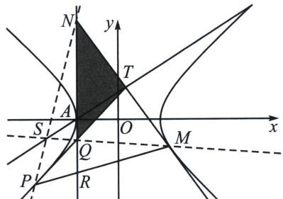

> [!faq]- 《圆锥曲线专题(下册)》例题解析
>
> > [!success]- **【答案】** 详见解析
>
> > [!note]- **【解析】**
> > 解析 (1) $x^{2} - \frac{y^{2}}{4} = 1$
> >
> > (2)(i) $-1<t<\frac{5}{3}$ 且 $t\neq1,\quad t\neq-\frac{1}{3}$ (渐近线)(参考本书第三章详解)
> >
> > (ii)背景解读: 1 帕斯卡定理+笛沙格定理: $PPAAMM$ 中, $PP$ 与 $AM$ 交于 $D$ , $PA$ 与 $MM$ 交于 $E$ , $AA$ 与 $MP$ 交于 $R$ , 所以 $EDR$ 为帕斯卡线, $PN$ , $AT$ , $QM$ 三线共点 $S$ , 所以 $S$ 在 $AT$ 上(笛沙格定理).
> >
> > 
> >
> > 背景解读2：作出热尔岗三角形 $TNQ$ ，则 $PN$ 、 $QM$ 、 $AT$ 三线共点，此时热尔岗点 $S$ 一定在定直线 $y = x + 1$ 上.
