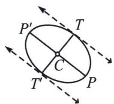
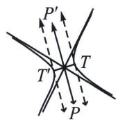
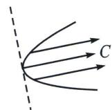
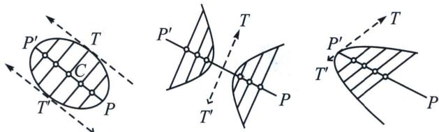
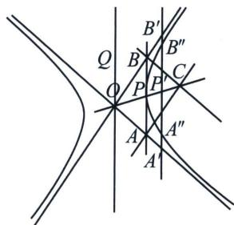

## 四、双曲线渐近线和共轭直径

无穷远点的极线称为圆锥曲线的直径，而无穷远直线的极点称为圆锥曲线的中心.

根据极点和极线的调和性质，不难证明：直径都通过中心；通过中心的直线也都是直径.

  
1 椭圆

2 双曲线

3 抛物线

## 高中数学 新思路 圆锥专题

直径 $PP'$ 或 $TT'$ 都是无穷远点的极线，中心 $C$ 是无穷远直线的极点。直径都通过 $C$ ，且通过 $C$ 的直线都是直径。椭圆和双曲线是有心曲线。其中，椭圆中心位于曲线内，它的每一条直径与曲线交于 2 点，因而直径都是弦。双曲线的中心位于曲线外，它的直径（通过中心的直线）可以与曲线交于 2 点，如上图中的 $TT'$ ；也可能没有任何交点，如图中的 $PP'$ ；

通过直径 $TT'$ 方向无穷远点的所有弦被直径 $PP'$ 平分中心平分通过它的所有的弦；通过同一个无穷远点的所有弦（即一组平行弦中的每一条）被以该无穷远点为极线的直径所平分，把两条直线称为关于圆锥曲线的相互共轭的直线，如果其中任意一条线通过另一条的极点．关于圆锥曲线的共轭直线，我们有下列定理：

任意直径平分所有与其共轭的直径平行的的弦；任一直径两个端点的切线为平行线，且平行于其共轭直径；平行于外切平行四边形边的两个直径为共轭直径.

这就是中点弦定理，也是第三定义的中位线本质，我们通常用点差法来证明.

回到 Brianchon 定理关于退化的三角形, 外切于圆锥曲线的三角形的三个顶点与对边上的切点的连线交于同一点. 我们来解读双曲线, 双曲线是有心曲线. 通过中心 $O$ 的直线都称直径. 双曲线与无穷远直线有两个交点, 双曲线的两条渐近线就是它的两个无穷远点的切线. 如果我们再作任意第三条切线, 则它将与原来的两条切线 (渐近线) 生成两个交点, 设它们分别为 $A$ 和 $B$ . 则中心与 $A$ , $B$ 三点形成一个外切于双曲线三角 $OAB$ , 这也是我们前面章节提到的渐切三角形.

按照 Brianchon 定理可知: 通过 $A$ 平行于 $OB$ 的直线、通过 $B$ 平行于 $OA$ 的直线、以及通过切线 $AB$ 切点 $P$ 的直线 $OP$ , 三线交于一个共同点 $C$ . 但因 $OACB$ 是一平行四边形, 故其对角线相互平分, 由此知 $PA = PB$ . 这样我们得到下面的定理:

由双曲线的两条渐近线切割任意第三条切线而成的线段 AB 被该切线的切点 P 所平分.

AB 为过双曲线任一点 P 的切线，则 PA = PB

在双曲线中，中心位于曲线的外部，参看图中 O 点，从曲线中心向曲线所作的两条切线与曲线在两个不同的无穷远点相切，而两条切线本身在中心相交。这两条切线称曲线的渐近线。而椭圆和抛物线都没有渐近线。如果在上图中，我们通过中心 O 作一直线 OQ 平行与 AB，则 OQ 与 OP 一样，都是直径。因 OQ 与 P 点的切线平行，而 P 点是 OP 和曲线的交点，故 OP 和 OQ 是一对共轭直径。又因 A, P, B 以及 AB 的无穷远点是四调和点，我们得到下述有关双曲线的定理：

双曲线的共轭直径关于其渐近线调和共轭.

平行于直径 $OQ$ 的弦 $A''B''$ 被共轭的直径 $OP$ 的平分于 $P'$ 点．设弦与渐近线交于点 $A''$ 和 $B''$ ，则点 $A'$ 、 $P'$ 、 $B'$ 和无穷远点是四调和点，由此 $P'$ 是 $A'B'$ 中点．而 $A'A''=B'B''$ ，我们有下列定理：

双曲线的所有弦被双曲线和它的渐近线切割出来的线段的长度相等.
