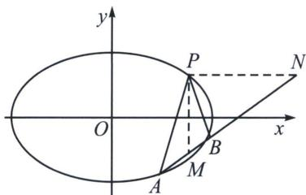

## 一、斜率和为0与内外角平分线解读

已知点 A, B 是椭圆 $\frac{x^{2}}{a^{2}} + \frac{y^{2}}{b^{2}} = 1 (a > b > 0)$ 上的动点， $P(x_{0}, y_{0})$ ，直线 PA, PB 的斜率和为 0，则直线 AB 的斜率为 $\frac{b^{2}x_{0}}{a^{2}y_{0}}$ .

如图所示，过点 P 作 x，y 轴的平行线，分别交 AB 于点 N，M，则 PM，PN 分别是 $\angle APB$ 的内角，外角平分线，所以 $(AB, MN) = -1$ ，所以 $M(x_{0}, m)$ ， $N(n, y_{0})$ 是椭圆的一组调和共轭点，即 $\frac{x_{0} \cdot n}{a^{2}} + \frac{m \cdot y_{0}}{b^{2}} = 1$ ， $k_{AB} = \frac{m - y_{0}}{x_{0} - n} = \frac{b^{2} x_{0}}{a^{2} y_{0}}$ .

![[高中/总复习/专题/2026版高中《mst老唐说题》圆锥曲线专题（数学）/下册/第12章_调和点列与调和线束定理与对合关系/第三节_角平分线与调和点列/一_斜率和为0与内外角平分线解读/例题/Q00048828.md]]
![[高中/总复习/专题/2026版高中《mst老唐说题》圆锥曲线专题（数学）/下册/第12章_调和点列与调和线束定理与对合关系/第三节_角平分线与调和点列/一_斜率和为0与内外角平分线解读/例题/Q00048829.md]]
