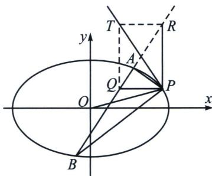

<!-- question-source:start -->
例2 (2023·广州模拟)已知椭圆 $C: \frac{x^{2}}{a^{2}} + \frac{y^{2}}{b^{2}} = 1 (a > b > 0)$ 的离心率为 $\frac{\sqrt{2}}{2}$ , 以 $C$ 的短轴为直径的圆与直线 $y = ax + 6$ 相切.

(1)求 C 的方程;

(2) 直线 $l: y = k(x - 1) (k \geqslant 0)$ 与 $C$ 相交于 $A, B$ 两点，过 $C$ 上的点 $P$ 作 $x$ 轴的平行线交线段 $AB$ 于点 $Q$ ，直线 $OP$ 的斜率为 $k'$ （ $O$ 为坐标原点）， $\triangle APQ$ 的面积为 $S_1$ 。 $\triangle BPQ$ 的面积为 $S_2$ ，若 $|AP| \cdot S_2 = |BP| \cdot S_1$ ，判断 $k \cdot k'$ 是否为定值？并说明理由。

(1)由椭圆的离心率为 $\frac{\sqrt{2}}{2}$ , 得 $\frac{a^2 - b^2}{a^2} = \frac{1}{2}$ , 即有 $a^2 = 2b^2$ , 由以 $C$ 的短轴为直径的圆与直线 $y = ax + 6$ 相切得: $\frac{6}{\sqrt{a^2 + 1}} = b$ , 联立解得 $a^2 = 8, b^2 = 4$ , 所以 $C$ 的方程为 $\frac{x^2}{8} + \frac{y^2}{4} = 1$ ;

(2)因为 $|AP|\cdot S_{2}=|BP|\cdot S_{1}$ ，则 $\frac{|AP|}{|BP|}=\frac{S_{1}}{S_{2}}=\frac{\frac{1}{2}|AP||PQ|\sin\angle APQ}{\frac{1}{2}|BP||PQ|\sin\angle BPQ}=\frac{|AP|\sin\angle APQ}{|BP|\sin\angle BPQ}$

因此 $\sin\angle APQ=\sin\angle BPQ$ ，而 $\angle APQ+\angle BPQ=\angle ABP\in(0,\pi)$ ，有 $\angle APQ=\angle BPQ$ ，

于是可得 PQ 平分 $\angle APB$ ，所以直线 AP，BP 的斜率互为相反数，即 $k_{AP} + k_{BP} = 0$ ，

极点极线背景分析：设 $P(x_0, y_0)$ ，由于 $k_{PA} + k_{PB} = 0$ ，故作 $PR \parallel y$ 轴交 $AB$ 延长线于 $R$ ，此时 $R(x_0, n)$ ， $Q(m, y_0)$ ，由于 $k_{PA} + k_{PB} = 2k_{PQ} = 0$ ，故 $P(RQ, AB) = -1$ ，所以 $\frac{x_R x_Q}{8} + \frac{y_R y_Q}{4} = 1$ ，即 $\frac{x_0 m}{8} + \frac{ny_0}{4} = 1$ ，显然，点 $T(m, n)$ 在 $P$ 处的切线 $PT$ 上， $k = -k_{PT}$ ， $k' k_{PT} = -\frac{b^2}{a^2} = -\frac{1}{2}$ ，所以 $kk' = \frac{1}{2}$ .

(齐次化书写过程): 将椭圆 $C$ 按向量 $\overrightarrow{PO} = (-x_0, -y_0)$ 平移得椭圆 $C'$ : $\frac{(x + x_0)^2}{a^2} + \frac{(y + y_0)^2}{b^2} = 1$ ,

又点 $P(x_0, y_0)$ 在椭圆 $\frac{x^2}{8} + \frac{y^2}{4} = 1$ 上，所以 $\frac{x_0^2}{8} + \frac{y_0^2}{4} = 1$ ，代入上式得 $\frac{x^2}{8} + \frac{y^2}{4} + \frac{x_0}{4}x + \frac{y_0}{2}y = 0$ ①．椭圆 $C$ 上的定点 $P(x_0, y_0)$ 和动点 $A$ ， $B$ 分别对应椭圆 $C'$ 上的定点 $O$ 和动点 $A'$ ， $B'$ ，设直线 $A'B'$ 的方程为 $mx + ny = 1$ ，代入 ① 得： $\frac{x^2}{8} + \frac{y^2}{4} + \left(\frac{x_0}{4}x + \frac{y_0}{2}y\right)(mx + ny) = 0$ ，当 $x \neq 0$ 时，两边除以 $x^2$ 得： $\frac{1 + 2y_0n}{4}\frac{y^2}{x^2} +$ $\left(\frac{x_0n}{4} + \frac{y_0m}{2}\right)\frac{y}{x} + \frac{1 + 2x_0m}{8} = 0$ ，因为点 $A'$ ， $B'$ 的坐标满足这个方程，所以 $k_{OA'}$ ， $k_{OB'}$ 是这个关于 $\frac{y}{x}$ 的方程的两个根。所以 $k_{OA'} + k_{OB'} = 0$ ，即 $\frac{x_0n}{4} + \frac{y_0m}{2} = 0$ ，由此得 $k_{A'B'} = -\frac{m}{n} = \frac{x_0}{2y_0} = k$ 。即 $k \times \frac{y_0}{x_0} = k \cdot k' = \frac{1}{2}$ ，

所以 $k \cdot k'$ 为定值，且 $k \cdot k' = \frac{1}{2}$ .
<!-- question-source:end -->

![[高中/总复习/专题/2026版高中《mst老唐说题》圆锥曲线专题（数学）/下册/第12章_调和点列与调和线束定理与对合关系/第三节_角平分线与调和点列/一_斜率和为0与内外角平分线解读/例题/answers/Q00048829A1.md]]
