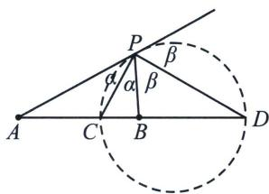

## 三、内外角平分线隐藏阿氏圆

一般地, 平面内到两个定点距离之比为常数 $\lambda (\lambda > 0, \lambda \neq 1)$ 的点的轨迹是圆, 此圆被叫做“阿波罗尼斯圆”。特殊地, 当 $\lambda = 1$ 时, 点 $P$ 的轨迹是线段 $AB$ 的中垂线.

求证：已知动点 $P$ 与两定点 $A 、 B$ 的距离之比为 $\lambda (\lambda > 0)$ ，那么点 $P$ 的轨迹是什么？

证明：不妨设 $A(-c, 0)$ 、 $B(c, 0)(c > 0)$ ， $P(x, y)$ ，由 $\frac{|PA|}{|PB|} = \lambda (\lambda > 0)$ 得： $\frac{\sqrt{(x + c)^2 + y^2}}{\sqrt{(x - c)^2 + y^2}} = \lambda$ ，即 $(1 - \lambda^2)x^2 + 2c(1 + \lambda^2)x + c^2(1 - \lambda^2) + (1 - \lambda^2)y^2 = 0$ ，

①当 $\lambda\neq1$ 时，即为 $x^{2}+\frac{2c(1+\lambda^{2})}{1-\lambda^{2}}x+c^{2}+y^{2}=0$ ，整理得： $\left(x-\frac{\lambda^{2}+1}{\lambda^{2}-1}c\right)^{2}+y^{2}=\left(\frac{2\lambda c}{\lambda^{2}-1}\right)^{2}$ ，即点 P 的轨迹是以 $\left(\frac{\lambda^{2}+1}{\lambda^{2}-1}c,0\right)$ 为圆心， $\left|\frac{2\lambda c}{\lambda^{2}-1}\right|$ 为半径的圆；

②当 $\lambda=1$ 时，化简得 x=0，即点 P 的轨迹为 y 轴.

如图，易知①PC 为∠APB 的内角平分线，PD 为∠APB 的外角平分线，②P(AB, CD) = -1 ③PC⊥PD；以上三个条件中，知道任意两个都可以推得第三个！

设阿波罗尼斯圆的圆心为 $O$ ，半径 $OC = OD = r$ ，则有 $\frac{PA}{PB} = \frac{AC}{CB} = \frac{AD}{DB} = \lambda$ ，即 $\frac{OA - r}{r - OB} = \frac{OA + r}{OB + r} = \lambda$ ，即 $\frac{OA - r + OA + r}{r - OB + r + OB} = \frac{OA - r - (OA + r)}{r - OB - (r + OB)} = \lambda$ ，即 $\frac{OA}{r} = \frac{r}{OB} = \lambda$ ，即 $OA \cdot OB = r^2$ （反演）.

同时， $\frac{OA}{r}=\frac{r}{OB}=\lambda\Rightarrow\left\{\begin{aligned}\frac{OA}{r}&= \lambda\\ \frac{OB}{r}&=\frac{1}{\lambda}\end{aligned}\right.\Rightarrow\frac{OA}{r}-\frac{OB}{r}=\frac{AB}{r}=\lambda-\frac{1}{\lambda}$ ，即 $r=\frac{AB}{\lambda-\frac{1}{\lambda}}$ .

## 隐藏的角平分线与阿氏圆构造

![[高中/总复习/专题/2026版高中《mst老唐说题》圆锥曲线专题（数学）/下册/第12章_调和点列与调和线束定理与对合关系/第三节_角平分线与调和点列/三_内外角平分线隐藏阿氏圆/例题/Q00053182.md]]
![[高中/总复习/专题/2026版高中《mst老唐说题》圆锥曲线专题（数学）/下册/第12章_调和点列与调和线束定理与对合关系/第三节_角平分线与调和点列/三_内外角平分线隐藏阿氏圆/例题/Q00053183.md]]
