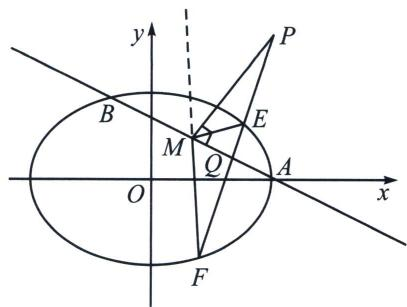

<!-- question-source:start -->
例5 (2025·山东省实验中学四诊第18题)已知椭圆 $C: \frac{x^{2}}{a^{2}} + \frac{y^{2}}{b^{2}} = 1 (a > b > 0)$ 的半长轴的长度与焦距相等, 且过焦点且与 $x$ 轴垂直的直线被椭圆截得的弦长为3.

(1)求椭圆 C 的方程;

(2)已知直线 $l_{0}$ ： $x+2y-2=0$ 与椭圆 C 交于 A，B 两点，过点 $P(2,3)$ 的直线交椭圆 C 于 E，F 两点 (E 在靠近 P 的一侧)

(i) 求 $\frac{|PE|}{|PF|}$ 的取值范围；

（ii）在直线 $l_{0}$ 上是否存在一定点 $M$ ，使 $\angle EMA = \angle FMA$ 恒成立？若存在，求出 $M$ 点坐标；若不存在，请说明理由.

(1)由题意可得 $\left\{ \begin{array}{l} 2c = 2 \cdot \sqrt{a^2 - b^2} = a \\ \frac{2b^2}{a} = 3 \end{array} \right. \Rightarrow \left\{ \begin{array}{l} a = 2 \\ b = \sqrt{3} \\ c = 1 \end{array} \right.$ ，则椭圆 $C$ 的方程为 $\frac{x^2}{4} + \frac{y^2}{3} = 1$ .

(2)极点极线背景: 以 $P$ 为极点, 其对应极线为 $AB$ , 令 $EF$ 与 $AB$ 交于 $Q$ , 所以 $(P, Q; E, F) = -1(E$ 在靠近 $P$ 的一侧), 故 $\overrightarrow{EP} = \lambda \overrightarrow{PF} (-1 < \lambda < 0)$ , 则 $\overrightarrow{EQ} = -\lambda \overrightarrow{QF} (\lambda < 0)$ , 利用非轴点弦定比点差和三角换元处理 $\left| \frac{PE}{PF} \right|$ ; 当 $\angle EMA = \angle FMA$ , 可以根据调和点列由内外角平分线共同构成, 故 $PM$ 为 $\angle EMF$ 外角平分线, 所以 $PM \perp AB$ , $\left\{ \begin{array}{l} \frac{x}{2} + y = 1 \\ y - 3 = 2(x - 2) \end{array} \Rightarrow M\left( \frac{4}{5}, \frac{3}{5} \right) \right.$
<!-- question-source:end -->

![[高中/总复习/专题/2026版高中《mst老唐说题》圆锥曲线专题（数学）/下册/第12章_调和点列与调和线束定理与对合关系/第三节_角平分线与调和点列/三_内外角平分线隐藏阿氏圆/例题/answers/Q00048832A1.md]]
