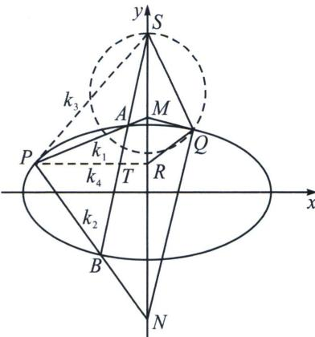

> [!faq]- 《圆锥曲线专题(下册)》例题解析
>
> > [!success]- **【答案】** 详见解析
>
> > [!note]- **【分析】**
> > 以 S 作为极点，其极线方程为 y=1，所以 PR 即为 S 对应的极线，所以 $P(S, T; A, B)=-1$ ，PA、PB、PS、PR 为相应调和线束，斜率分别设为 $k_{1}$ 、 $k_{2}$ 、 $k_{3}$ 、 $k_{4}$ ，由于 $k_{4}=0$ ，所以 $\frac{1}{k_{1}}+\frac{1}{k_{2}}=\frac{2}{k_{3}}=\sqrt{3}$ ；解答过程：将椭圆向右平移 $2\sqrt{3}$ 个单位，再向下平移 1 个单位得 $C':\frac{(x-2\sqrt{3})^{2}}{15}+\frac{(y+1)^{2}}{5}=1$ ，即 $x^{2}+3y^{2}+6y-4\sqrt{3}x=0$ ，设直线 AB 平移后的直线方程为 $A'B'$ ： $mx+ny=1$ ，因为直线 $A'B'$ 过点 $(2\sqrt{3}, 4)$ ，
>
> > [!note]- **【解析】**
> > 
> > 所以 $2\sqrt{3}m+4n=1$ ，此时 $x^{2}+3y^{2}+(6y-4\sqrt{3}x)(mx+ny)=0$ ，同除以 $x^{2}$ 得：
> > 可得 $(6n + 3)k^{2} + (6m - 4\sqrt{3} n)k + (1 - 4\sqrt{3} m) = 0$ ，所以 $k_{1} + k_{2} = -\frac{6m - 4\sqrt{3} n}{6n + 3}$ ， $k_{1}k_{2} = \frac{1 - 4\sqrt{3} m}{6n + 3}$ 则 $\frac{1}{k_1} +\frac{1}{k_2} = \frac{k_1 + k_2}{k_1k_2} = -\frac{6m - 4\sqrt{3} n}{1 - 4\sqrt{3} m} = -\frac{6m - \sqrt{3}(1 - 2\sqrt{3} m)}{1 - 4\sqrt{3} m} = \sqrt{3};$
> > (3)极点极线背景: 交比不变性 $P(S, T; A, B) = P(S, R; M, N) = -1$ , 又 $\angle MQR = \angle NQR$ 恒成立, 根据内外角平分线构成调和点列, 所以 $SQ$ 为 $\angle MQN$ 外角平分线, 则 $\angle SQR = 90^{\circ}$ , 故 $Q$ 在一个以 $SR$ 为直径的阿氏圆上, 联立 $\left\{ \begin{array}{l} x^{2} + y^{2} - 6y + 5 = 0 \\ \frac{x^{2}}{15} + \frac{y^{2}}{5} = 1 \end{array} \right.$ , 解得 $y = 2$ 或 $y = -5$ (舍去), 点 $Q(-\sqrt{3}, 2)$ 或 $Q(\sqrt{3}, 2)$
> > 解答过程: $\frac{1}{k_1} + \frac{1}{k_2} = \sqrt{3} = \frac{2}{k_{PS}}$ , 所以 $\frac{1}{y_M - y_R} + \frac{1}{y_N - y_R} = \frac{2}{y_S - y_R}$ , 所以 $\frac{1}{|MR|} - \frac{1}{|NR|} = \frac{2}{|SR|}$ , 所以 $\frac{1}{|MR|} - \frac{1}{|SR|} = \frac{1}{|NR|} + \frac{1}{|SR|}$ , 即 $\frac{|MR|}{|NR|} = \frac{|MS|}{|SN|}$ , 根据内角平分线性质, 可得 $\frac{|QM|}{|QN|} = \frac{|RM|}{|RN|}$ , 故 $\frac{|QM|}{|QN|} = \frac{|MS|}{|SN|}$ , 所以 $SQ$ 为 $\angle MQN$ 外角平分线, 所以 $\angle SQR = 90^\circ$ , 易知 $Q$ 轨迹是一个以 $SR$ 为直径定圆, 可得 $x^2 + y^2 - 6y + 5 = 0$ , 联立 $\left\{ \begin{array}{l} x^2 + y^2 - 6y + 5 = 0 \\ \frac{x^2}{15} + \frac{y^2}{5} = 1 \end{array} \right.$ , 消去 $x$ 并整理得 $y^2 + 3y - 10 = 0$ , 解得 $y = 2$ 或 $y = -5$ (舍去).
> > 综上所述，椭圆 C 上存在点 $Q(-\sqrt{3}, 2)$ 或 $Q(\sqrt{3}, 2)$ 使得 $\angle MQR = \angle NQR$ 恒成立.
