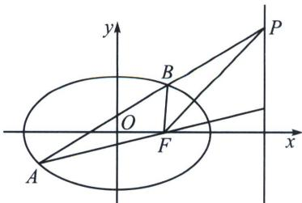
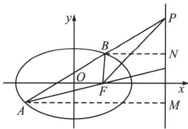
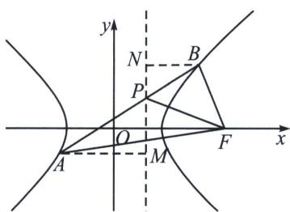

## 二、内外角平分线与焦准模型

## 1. 椭圆外角平分线与焦准模型

外角平分线模型设 F 和 l 是圆雉曲线一组对应的焦点和准线，圆雉曲线的弦 AB 交准线 l 于点 M，则 M 到 AF，BF 的距离是相等的，亦即 MF 是 $\angle AFB$ 的内角平分线或者外角平分线.

显然，当且仅当弦 AB 交双曲线于两支时，MF 是 $\angle AFB$ 的内角平分线.

证明: 如图, 过点 $A$ , $B$ 作准线 $l$ 的垂线, 垂足分别为 $M$ , $N$ , 则 $\frac{AF}{BF} = \frac{AM}{BN} = \frac{AP}{PB}$ , 根据外角平分线的逆定理, 所以 $PF$ 平分 $\angle AFB$ 的外角.

## 2. 双曲线内角平分线与焦准模型

证明：如图，过点 A, B 作准线 l 的垂线，垂足分别为 M, N，则 $\frac{AF}{BF} = \frac{AM}{BN} = \frac{AP}{PB}$ ，根据内角平分线的逆定理，所以 PF 平分 $\angle AFB$ 的外角.

![[高中/总复习/专题/2026版高中《mst老唐说题》圆锥曲线专题（数学）/下册/第12章_调和点列与调和线束定理与对合关系/第三节_角平分线与调和点列/二_内外角平分线与焦准模型/例题/Q00048830.md]]
![[高中/总复习/专题/2026版高中《mst老唐说题》圆锥曲线专题（数学）/下册/第12章_调和点列与调和线束定理与对合关系/第三节_角平分线与调和点列/二_内外角平分线与焦准模型/例题/Q00048831.md]]
