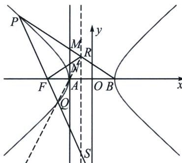

<!-- question-source:start -->
例4 (2024·茂名一模)已知双曲线 $E: \frac{x^{2}}{a^{2}} - \frac{y^{2}}{3} = 1 (a > 0)$ 的左焦点为 $F, A, B$ 分别为双曲线的左、右顶点，顶点到双曲线的渐近线的距离为 $\frac{\sqrt{3}}{2}$ .

(1)求 E 的标准方程;

(2) 过点 B 的直线与双曲线左支交于点 P (异于点 A)，直线 BP 与直线 l: x = -1 交于点 M， $\angle PFA$ 的角平分线交直线 l 于点 N，证明：N 是 MA 的中点.

(1) $E$ 的标准方程为 $x^{2} - \frac{y^{2}}{3} = 1$ .

(2)极点极线背景分析：延长 $PF$ 交双曲线于 $Q$ ，交准线 $x = -\frac{1}{2}$ 于 $S$ ， $PM$ 交准线于 $R$ ，此时 $F$ 、 $N$ 、 $R$ 三点共线， $R$ 、 $A$ 、 $Q$ 三点共线。故 $R(P, Q; F, S) = R(M, A; N, \infty) = -1$ ，故 $|MN| = |NA|$ 。

(2)解法一: 证明: ①当 $\angle PFA = 90^{\circ}$ , 即 $PF \perp AF$ 时, 设点 $P(-2, y_{p})$ ,

代入双曲线方程得， $(-2)^{2} - \frac{y_{p}^{2}}{3} = 1$ ，解得 $y_{p} = \pm 3$ ，取第二象限的点，则 $P(-2,3)$

因为 $B(1,0)$ ，所以直线 BP 的斜率为 $k_{BP}=\frac{3-0}{-2-1}=-1$ ，所以直线 BP 的方程为 $y=x+1$ ，令 x=-1，解得 y=2，即 $M(-1,2)$ ，因为直线 FN 是 $\angle PFA$ 的角平分线，且 $\angle PFA=90^{\circ}$ ，所以直线 FN 的斜率为 $k_{FN}=1$ ，

直线 $FN$ 的方程为 $y = x + 2$ ，令 $x = -1$ ，解得 $y = 1$ ，即 $N(-1, 1)$ ，此时 $|AN| = \frac{1}{2} |AM|$ ，即 $N$ 是 $MA$ 的中点；

②当 $\angle PFA \neq 90^{\circ}$ 时, 设直线 $BP$ 的斜率为 $k$ , 则直线 $BP$ 的方程为 $y = k(x - 1)$ ,

联立方程 $\left\{\begin{aligned}y&=k(x-1)\\ x^{2}&-\frac{y^{2}}{3}=1\end{aligned}\right.$ ，消去y得 $(3-k^{2})x^{2}+2k^{2}x-(k^{2}+3)=0$ ，由韦达定理得， $x_{B}x_{P}=\frac{k^{2}+3}{k^{2}-3}$

又因为 $x_{B} = 1$ ，所以 $x_{p} = \frac{k^{2} + 3}{k^{2} - 3}, y_{P} = k(x_{P} - 1) = \frac{6k}{k^{2} - 3}$ ，点 $P\left(\frac{k^2 + 3}{k^2 - 3}, \frac{6k}{k^2 - 3}\right)$ ，又因为 $F(-2,0)$ 所以 $k_{PF} = \frac{\frac{6k}{k^2 - 3}}{\frac{k^2 + 3}{k^2 - 3} + 2} = \frac{6k}{3k^2 - 3} = \frac{2k}{k^2 - 1}$ ，由题意可知，直线 $NF$ 的斜率存在，设为 $k'$ ，则直线 $NF: y = k'(x + 2)$ ，因为 $FN$ 是∠PFA的角平分线，所以∠PFB=2∠NFB，所以 $\tan \angle PFB = \tan 2\angle NFB$

又因为 $\tan \angle PFB = k_{PF} = \frac{2k}{k^2 - 1}$ , $\tan 2\angle NFB = \frac{2\tan\angle NFB}{1 - \tan^2\angle NFB} = \frac{2k'}{1 - k'^2}$ ,

所以 $\frac{2k}{k^2 - 1} = \frac{2k'}{1 - k'^2}$ ，即 $k'k^2 + (k'^2 - 1)k - k' = 0$ ，即 $(k + k') (kk' - 1) = 0$ ，得 $k = -k'$ 或 $= \frac{1}{k'}$

由题意知 k 和 $k'$ 异号，所以 $k = -k'$ ，所以直线 FN 的方程为 $y = -k(x + 2)$ ，

令 $x = -1$ ，可得 $y = -k$ ，即 $N(-1, -k)$ ，所以 $|AN| = |-k|$ ，直线 $PB$ 的方程为 $y = k(x - 1)$ ，令 $x = -1$ ，可得 $y = -2k$ ，即 $M(-1, -2k)$ ，所以 $|AM| = |-2k|$ ，所以 $\frac{|AN|}{|AM|} = \frac{|-k|}{|-2k|} = \frac{1}{2}$ ，即 $N$ 是 $MA$ 的中点。综上， $N$ 是 $MA$ 的中点。
<!-- question-source:end -->

![[高中/总复习/专题/2026版高中《mst老唐说题》圆锥曲线专题（数学）/下册/第12章_调和点列与调和线束定理与对合关系/第三节_角平分线与调和点列/二_内外角平分线与焦准模型/例题/answers/Q00048831A1.md]]
