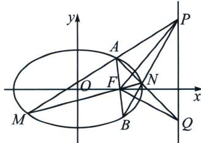

> [!faq]- 《圆锥曲线专题(下册)》例题解析
>
> > [!success]- **【答案】** 4
>
> > [!note]- **【解析】**
> > 解析 由椭圆方程可知 $a = 2, c = 1$ ，所以 $e = \frac{1}{2}$ ， $F$ 为椭圆的右焦点，设 $M(x_1, y_1), N(x_2, y_2)$ ，
> >
> > 所以由椭圆的第二定义可得 $e = \frac{|MF|}{d_1} = \frac{|NF|}{d_2}$ ，即有 $|MF| = 2 - \frac{1}{2} x_1$ ， $|NF| = 2 - \frac{1}{2} x_2$ ，设 $\angle MFN$ 的外角平分线与 $l$ 交于点 $P(m, n)$ ，所以 $\frac{|MF|}{|NF|} = \frac{|MP|}{|NP|}$ ，即 $\frac{x_1 - m}{x_2 - m} = \frac{2 - \frac{1}{2} x_1}{2 - \frac{1}{2} x_2}$ ，又因 $x_1 \neq x_2$ ，化简可得 $m = 4$ ，故答案为4.
> >
> > ## 3. 双外角平分线垂直模型
> >
> > 设 AB，MN 是过椭圆焦点 F 的两条弦，MA，NA 分别交对应的准线于 P，Q 则有 $FM \perp FN$ ;
> >
> > 
> >
> > 注意 一般考试中，MN通常为椭圆的左右顶点，所以会经常利用调和线束+平行弦构造中点来考查.
