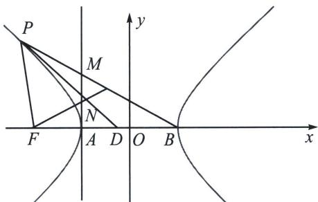

> [!faq]- 《圆锥曲线专题(下册)》例题解析
>
> > [!success]- **【答案】** 详见解析
>
> > [!note]- **【分析】**
> > 本题未单列分析。
>
> > [!note]- **【解析】**
> > 解析
> > 解答书写过程:
> > 解法二(三线合一构造):
> > 
> > 在 $x$ 轴上截取 $|FD| = |PF|$ ，连接 $PD$ ，易知 $PD \perp FN$ ，根据焦半径公式可得 $|PF| = -a - ex_0 = -1 - 2x_0$ ，故 $D(-3 - 2x_0, 0)$ ， $k_{PD} = \frac{y_0}{3x_0 + 3}$ ，故 $k_{FN} = -\frac{3x_0 + 3}{y_0}$ ， $k_{PF} = \frac{y_0}{x_0 + 2}$ ， $k_{PB} = \frac{y_0}{x_0 - 1}$ ，
> > 当 $x = -1$ 时， $y_{N} = -\frac{3x_{0} + 3}{y_{0}} (-1 + 2) = -\frac{3x_{0} + 3}{y_{0}}$ ， $y_{M} = \frac{y_{0}}{x_{0} - 1} (-1 - 1) = \frac{-2y_{0}}{x_{0} - 1}$ ，
> > 由于 $x_0^2 -\frac{y_0^2}{3} = 1$ ，故 $-\frac{3x_0 + 3}{y_0} = \frac{-y_0}{x_0 - 1}$ ，所以 $y_{M} = 2y_{N}$ ，即 $N$ 是 $MA$ 的中点.
> > 解法三(焦弦公式):
> > $$
> > \angle P F A = 2 \theta , | P F | = \frac {b ^ {2}}{a + c \cos 2 \theta} = \frac {3}{1 + 2 \cos 2 \theta}, y _ {P} = \frac {3 \sin 2 \theta}{1 + 2 \cos 2 \theta}, x _ {P} = - 2 + \frac {3 \cos 2 \theta}{1 + 2 \cos 2 \theta},
> > $$
> > $P$ 、 $M$ 、 $B$ 三点共线，所以 $\frac{y_M}{-2} = \frac{y_P}{x_P - 1}\Rightarrow y_M = \frac{\frac{-6\sin 2\theta}{1 + 2\cos 2\theta}}{-3 + \frac{3\cos 2\theta}{1 + 2\cos 2\theta}} = \frac{2\sin 2\theta}{1 + \cos 2\theta} = \frac{4\sin\theta\cos\theta}{2\cos^2\theta} = 2\tan \theta ,$
> > $y_{N}=|AF|\tan\theta=\tan\theta$ ，故 $y_{M}=2y_{N}$ ，即N是MA的中点.
