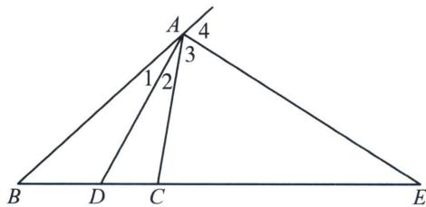

## 第三节 角平分线与调和点列

根据三角形的内角平分线定理: 在 $\triangle ABC$ 中, 若 $AD$ 是 $\angle BAC$ 的内角平分线, 则有 $\frac{AB}{AC} = \frac{BD}{DC}$ , $AE$ 是 $\angle BAC$ 的外角平分线, 则有 $\frac{AB}{AC} = \frac{BE}{EC}$ , 所以 $B 、 C 、 D 、 E$ 是调和点列.

![[高中/总复习/专题/2026版高中《mst老唐说题》圆锥曲线专题（数学）/下册/第12章_调和点列与调和线束定理与对合关系/第三节_角平分线与调和点列/一_斜率和为0与内外角平分线解读/一_斜率和为0与内外角平分线解读.md]]
![[高中/总复习/专题/2026版高中《mst老唐说题》圆锥曲线专题（数学）/下册/第12章_调和点列与调和线束定理与对合关系/第三节_角平分线与调和点列/二_内外角平分线与焦准模型/二_内外角平分线与焦准模型.md]]
![[高中/总复习/专题/2026版高中《mst老唐说题》圆锥曲线专题（数学）/下册/第12章_调和点列与调和线束定理与对合关系/第三节_角平分线与调和点列/三_内外角平分线隐藏阿氏圆/三_内外角平分线隐藏阿氏圆.md]]
