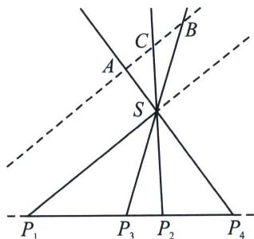
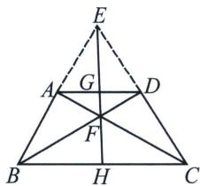

## 一、调和线束平行中点定理

如图所示，若 $(P_{1}P_{2}, P_{3}P_{4})=-1$ ， $SP_{1}$ ， $SP_{2}$ ， $SP_{3}$ ， $SP_{4}$ 均为S点的调和线束，过 $P_{4}S$ 延长线上任意一点A作 $AB\parallel SP_{1}$ 分别交 $SP_{3}$ 和 $SP_{2}$ 于点B和C，则AC=BC.

## 高中数学 新思路 圆锥专题

## 1. 利用调和梯形角度解读

证明：根据交比不变性，若 $(P_{1}P_{2}, P_{3}P_{4})=-1$ ，则 $(A, B; C, \infty)=-1$ ，故AC=CB.

完全四边形 ABCD 中， $AD \parallel BC$ ，边 AC 与 BD 交于 F，BA 与 CD 延长线交于 E，EF 与 AD 和 BC 交于 G 和 H 两点，则：① E、G、F、H 是调和点列；② G、H 分别为 AD、BC 中点；

证明：因为 $AD \parallel BC$ ，所以 $\frac{AD}{BC} = \frac{EA}{EB} = \frac{AG}{BH} = \frac{AF}{FC} = \frac{AG}{HC}$ ，所以 BH = HC，同理 AG = GD，而 $\frac{EG}{EH} = \frac{AG}{BH} = \frac{GF}{FH}$ ，所以 E、G、F、H 是调和点列.

![[高中/总复习/专题/2026版高中《mst老唐说题》圆锥曲线专题（数学）/下册/第12章_调和点列与调和线束定理与对合关系/第二节_调和线束两大定理的应用/一_调和线束平行中点定理/例题/Q00053164.md]]
![[高中/总复习/专题/2026版高中《mst老唐说题》圆锥曲线专题（数学）/下册/第12章_调和点列与调和线束定理与对合关系/第二节_调和线束两大定理的应用/一_调和线束平行中点定理/例题/Q00053165.md]]
![[高中/总复习/专题/2026版高中《mst老唐说题》圆锥曲线专题（数学）/下册/第12章_调和点列与调和线束定理与对合关系/第二节_调和线束两大定理的应用/一_调和线束平行中点定理/例题/Q00053166.md]]
![[高中/总复习/专题/2026版高中《mst老唐说题》圆锥曲线专题（数学）/下册/第12章_调和点列与调和线束定理与对合关系/第二节_调和线束两大定理的应用/一_调和线束平行中点定理/例题/Q00053167.md]]
![[高中/总复习/专题/2026版高中《mst老唐说题》圆锥曲线专题（数学）/下册/第12章_调和点列与调和线束定理与对合关系/第二节_调和线束两大定理的应用/一_调和线束平行中点定理/例题/Q00053168.md]]
![[高中/总复习/专题/2026版高中《mst老唐说题》圆锥曲线专题（数学）/下册/第12章_调和点列与调和线束定理与对合关系/第二节_调和线束两大定理的应用/一_调和线束平行中点定理/例题/Q00053169.md]]
![[高中/总复习/专题/2026版高中《mst老唐说题》圆锥曲线专题（数学）/下册/第12章_调和点列与调和线束定理与对合关系/第二节_调和线束两大定理的应用/一_调和线束平行中点定理/例题/Q00053170.md]]
![[高中/总复习/专题/2026版高中《mst老唐说题》圆锥曲线专题（数学）/下册/第12章_调和点列与调和线束定理与对合关系/第二节_调和线束两大定理的应用/一_调和线束平行中点定理/例题/Q00048814.md]]
![[高中/总复习/专题/2026版高中《mst老唐说题》圆锥曲线专题（数学）/下册/第12章_调和点列与调和线束定理与对合关系/第二节_调和线束两大定理的应用/一_调和线束平行中点定理/例题/Q00048815.md]]
![[高中/总复习/专题/2026版高中《mst老唐说题》圆锥曲线专题（数学）/下册/第12章_调和点列与调和线束定理与对合关系/第二节_调和线束两大定理的应用/一_调和线束平行中点定理/例题/Q00053171.md]]
