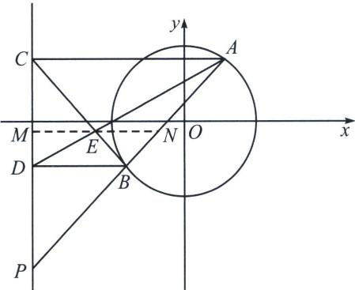

<!-- question-source:start -->
例1 (2024 秋·清远高二期中考试第 19 题) 已知圆 $O: x^{2} + y^{2} = 4$ , 直线 $l_{1}: y = x + b$ 与圆 $O$ 交于 $A$ , $B$ 两点, 过 $A, B$ 分别作直线 $l_{2}: x = m (m \in \mathbb{R})$ 的垂线, 垂足分别为 $C, D (C, D$ 分别异于 $A, B)$ .

(1)求实数 b 的取值范围;

(2) 若 m = -4，用含 b 的式子表示四边形 ABDC 的面积；

(3) 当 $b = m - 1$ 时, 若直线 $AD$ 和直线 $BC$ 交于点 $E$ , 证明点 $E$ 在某条定直线上运动, 并求出该定直线的方程.

(1) 因为圆 $O$ 的方程为: $x^{2} + y^{2} = 4$ , 所以其圆心为 $O(0, 0)$ , 半径为 2, 又直线 $l_{1}: y = x + b$ 与圆 $O$ 交于 $A, B$ 两点, 所以圆心 $O$ 到直线 $l_{1}$ 的距离 $d < r$ , 所以 $d = \frac{|b|}{\sqrt{1^2 + (-1)^2}} < 2$ , 解得 $-2\sqrt{2} < b < 2\sqrt{2}$ , 所以实数 $b$ 的取值范围为 $(-2\sqrt{2}, 2\sqrt{2})$ ;

(2)当 $m = -4$ 时，设 $A(x_{1},y_{1})$ ， $B(x_{2},y_{2})$ ，则 $C(-4,y_1)$ ， $D(-4,y_2)$ ，联立 $\left\{ \begin{array}{l}x^{2} + y^{2} = 4\\ y = x + b \end{array} \right.$ ，可得 $2x^{2} + 2bx + b^{2} - 4 = 0$ ，所以 $x_{1} + x_{2} = -b$ ， $x_{1}x_{2} = \frac{b^{2} - 4}{2}$ ，所以 $y_{1} - y_{2} = x_{1} - x_{2}$

所以 $|y_{1} - y_{2}| = \sqrt{(x_{1} - x_{2})^{2}} = \sqrt{(x_{1} + x_{2})^{2} - 4x_{1}x_{2}} = \sqrt{8 - b^{2}}$ ，因为四边形ABDC为直角梯形，

所以四边形 $ABDC$ 的面积为 $S_{ABDC} = \frac{1}{2} (|AC| + |BD|) |y_1 - y_2| = \frac{1}{2}(x_1 + 4 + x_2 + 4) |y_1 - y_2|$ $= \frac{(8 - b)\sqrt{8 - b^2}}{2}$ ;

(3)解法一: 由
(2)可知 $A(x_{1}, y_{1})$ , $B(x_{2}, y_{2})$ , 所以 $C(m, y_{1})$ , $D(m, y_{2})$ , 且直线 $AD$ 、 $BC$ 的斜率存在, 当 $b = m - 1$ 时, 由 (2)知: $x_{1} + x_{2} = -b = 1 - m$ , $x_{1}x_{2} = \frac{b^{2} - 4}{2} = \frac{m^{2} - 2m - 3}{2}$ , $y_{1} = x_{1} + m - 1$ , $y_{2} = x_{2} + m - 1$ , 所以直线 $AD$ 的方程为 $\frac{y - y_{2}}{y_{1} - y_{2}} = \frac{x - m}{x_{1} - m}$ , 直线 $BC$ 的方程为 $\frac{y - y_{1}}{y_{2} - y_{1}} = \frac{x - m}{x_{2} - m}$ ,

因为 $AD$ 、 $BC$ 相交，所以 $k_{AD} \neq k_{BC}$ ，即 $\frac{y_1 - y_2}{x_1 - m} \neq \frac{y_2 - y_1}{x_2 - m}, x_1 + x_2 \neq 2m,$

所以 $1 - m \neq 2m$ ，所以 $m \neq \frac{1}{3}$ ，联立 $\left\{ \begin{array}{l} \frac{y - y_2}{y_1 - y_2} = \frac{x - m}{x_1 - m} \\ \frac{y - y_1}{y_2 - y_1} = \frac{x - m}{x_2 - m} \end{array} \right.$ ，

可得 $y=\frac{y_{2}x_{1}+x_{2}y_{1}-my_{1}-my_{2}}{x_{1}+x_{2}-2m}=\frac{(x_{2}+m-1)(x_{1}-m)+(x_{2}-m)(x_{1}+m-1)}{x_{1}+x_{2}-2m}$

$$
= \frac {2 x _ {1} x _ {2} - (x _ {1} + x _ {2}) - 2 m (m - 1)}{x _ {1} + x _ {2} - 2 m} = \frac {m ^ {2} - 2 m - 3 - 1 + m - 2 m (m - 1)}{1 - m - 2 m} = \frac {m ^ {2} - m + 4}{3 m - 1},
$$

$$
x = \frac {x _ {1} x _ {2} - m (x _ {1} + x _ {2}) + m ^ {2}}{x _ {1} + x _ {2} - 2 m} + m = \frac {x _ {1} x _ {2} - m ^ {2}}{x _ {1} + x _ {2} - 2 m} = \frac {\frac {m ^ {2} - 2 m - 3}{2} - m ^ {2}}{1 - m - 2 m} = \frac {m ^ {2} + 2 m + 3}{2 (3 m - 1)},
$$

所以 $2x - y = \frac{3m - 1}{3m - 1} = 1$ ，所以点 $E$ 在定直线 $2x - y - 1 = 0$ 上运动.

<!-- question-source:end -->

![[高中/总复习/专题/2026版高中《mst老唐说题》圆锥曲线专题（数学）/下册/第12章_调和点列与调和线束定理与对合关系/第二节_调和线束两大定理的应用/一_调和线束平行中点定理/例题/answers/Q00048807A1.md]]
