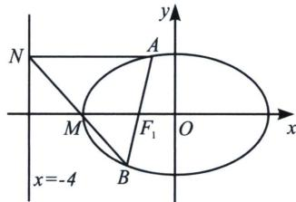

<!-- question-source:start -->
例2 已知椭圆 $C: \frac{x^2}{a^2} + \frac{y^2}{b^2} = 1 (a > b > 0)$ 的左、右焦点分别为 $F_1, F_2$ ，长轴长为 $4\sqrt{2}, A, B$ 为椭圆上的两个动点，当 $A, B$ 关于原点对称时， $(|AF_2| + |BF_2|) \cdot S_{\triangle ABF_2}$ 的最大值为 $16\sqrt{2}$ .

(1)求椭圆 C 的方程;

(2)若存在实数 $\lambda$ 使得 $\overrightarrow{AF_{1}} = \lambda \overrightarrow{AB}$ ，过点 A 作直线 x = -4 的垂线，垂足为 N，直线 NB 是否恒过某点？若恒过某点，求出该点坐标；若不过定点，请说明理由.

(1)椭圆 $C$ 的方程为 $\frac{x^2}{8} +\frac{y^2}{4} = 1$

(2)与调和点列相关的题型，只要极点在坐标轴上，一般选择定比点差作为最佳方法.

因为 $\overrightarrow{AF_{1}}=\lambda\overrightarrow{AB}$ ，所以A、F、B三点共线，令 $\overrightarrow{BF_{1}}=\mu\overrightarrow{F_{1}A}$ ， $B(x_{1},y_{1})$ ， $A(x_{2},y_{2})$ ，由定比分点公式得 $\frac{x_{1}+\mu x_{2}}{1+\mu}=-2$ ， $\frac{y_{1}+\mu y_{2}}{1+\mu}=0$ ，则在直线AB上必存在一点P，满足 $\overrightarrow{BP}=-\mu\overrightarrow{PA}$ ，所以 $x_{P}=\frac{x_{1}-\mu x_{2}}{1-\mu}$ ，

因为 A、B 均在椭圆上，则 $\left\{\begin{aligned}\frac{x_{1}^{2}}{8}+\frac{y_{1}^{2}}{4}&=1①\\ \frac{\mu^{2}x_{2}^{2}}{8}+\frac{\mu^{2}y_{2}^{2}}{4}&=\mu^{2}②\end{aligned}\right.$ ， $\frac{①-②}{1-\mu^{2}}$ 得 $\frac{(x_{1}+\mu x_{2})(x_{1}-\mu x_{2})}{8(1+\mu)(1-\mu)}+\frac{(y_{1}+\mu y_{2})(y_{1}-\mu y_{2})}{4(1+\mu)(1-\mu)}=1$

所以有： $\frac{-2x_P}{8} = 1$ ， $x_{P} = -4 = \frac{x_{1} - \mu x_{2}}{1 - \mu}$ ，所以可得：

$\left\{ \begin{array}{l} x_{1} + \mu x_{2} = -2(1 + \mu) \\ x_{1} - \mu x_{2} = -4(1 - \mu) \end{array} \right.$ ，故 $x_{1} = -3 + \mu$ 。令 $BN$ 交 $x$ 轴于 $M$ ，由于 $AN // MF_{1}$ ，所以 $\overrightarrow{BM} = \mu \overrightarrow{MN}$ ，所以 $x_{M} = \frac{x_{1} + \mu(-4)}{1 + \mu} = \frac{-3 + \mu - 4\mu}{1 + \mu} = -3$ ，故存在点 $M(-3,0)$ ，满足题意。
<!-- question-source:end -->

![[高中/总复习/专题/2026版高中《mst老唐说题》圆锥曲线专题（数学）/下册/第12章_调和点列与调和线束定理与对合关系/第二节_调和线束两大定理的应用/一_调和线束平行中点定理/例题/answers/Q00048808A1.md]]
