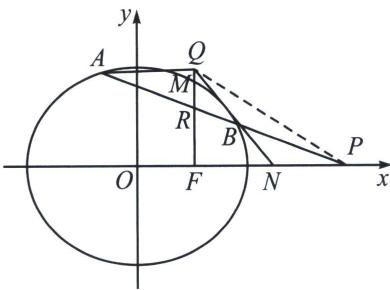

<!-- question-source:start -->
例4 (2024·甲卷)已知椭圆 $C: \frac{x^{2}}{a^{2}} + \frac{y^{2}}{b^{2}} = 1 (a > b > 0)$ 的右焦点为 $F$ , 点 $M \left(1, \frac{3}{2}\right)$ 在椭圆 $C$ 上, 且 $MF \perp x$ 轴.

(1)求椭圆 C 的方程;

(2) 过点 $P(4, 0)$ 的直线与椭圆 C 交于 A, B 两点，N 为线段 FP 的中点，直线 NB 与 MF 交于 Q，证明： $AQ \perp y$ 轴.

(1)椭圆 C 的方程为 $\frac{x^{2}}{4} + \frac{y^{2}}{3} = 1$ ;

(2)极点极线背景: 显然直线 $MF$ 是点 $P$ 所对应的极线, 设 $AP \cap MF = R$ , 则有 $A, B, R, P$ 是调和点列, 进而有 $QA, QN, QF, QP$ 是调和线束, 用 $x$ 轴来截取调和线束, 因为 $N$ 为 $FP$ 的中点, 由调和线束平行中点定理知 $AQ \parallel x$ 轴, 必然有 $AQ \perp y$ 轴; 涉及调和点列坐标翻译的最佳方法是定比点差.
<!-- question-source:end -->

![[高中/总复习/专题/2026版高中《mst老唐说题》圆锥曲线专题（数学）/下册/第12章_调和点列与调和线束定理与对合关系/第二节_调和线束两大定理的应用/一_调和线束平行中点定理/例题/answers/Q00048810A1.md]]
